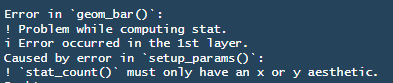
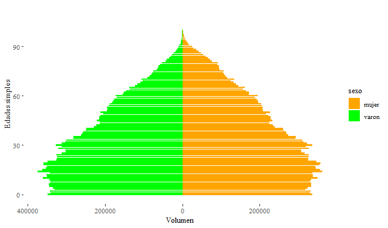
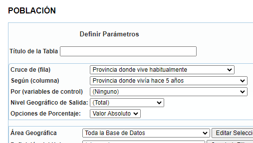

```{r setup, include=FALSE}
knitr::opts_chunk$set(echo = TRUE, warning = FALSE)
options(scipen=10000)
```

# Presentación  
Este curso es una introducción a R dirigido a investigadores en Ciencias Sociales y busca facilitar la aproximación a un software cuyo uso en investigación tiene ventajas que superan en mucho las dificultades que suelen aparecer en los primeros intentos.   

Para realizar análisis de datos existen numerosos programas informáticos, que se ocupan de los procesos computacionales, de manera que el usuario solo deba decidir qué procedimiento aplicar, cuidar que se cumplan las condiciones que hacen válido al procedimiento (los supuestos) y realizar una lectura correcta y completa del resultado que se obtiene, sin involucrarse con las operaciones de cálculo. Estos programas o "paquetes estadísticos" reúnen en un entorno único las operaciones más frecuentemente usadas por investigadores y analistas de datos y las ponen al alcance del usuario no especializado. Algunos de uso muy común son SPSS, SAS, INFOSTAT, STATA, STATISTICAL, etc. Aun así, hay razones para optar por R, porque manejar sus rudimentos es una inversión de tiempo que se vuelve una puerta de entrada a múltiples posibilidades. Esto se fundamenta en que R es varias cosas al mismo tiempo  

Es un software para análisis de datos: lo usan profesionales de la estadística, analistas de datos e investigadores de diversas disciplinas para extraer significado de información cuantitativa, para hacer descripciones e inferencias, visualización de datos y modelización predictiva.

Es un lenguaje de programación orientado a objetos, diseñado por estadísticos y para el uso en investigación cuantitativa: el análisis se hace escribiendo sentencias en este lenguaje, que provee objetos, operadores y funciones que hacen muy intuitivo el proceso de explorar, modelar y visualizar datos.

Es un ambiente para el análisis estadístico: en R hay funciones para prácticamente todo tipo de transformación de datos, de modelización y de representaciones gráficas que pueda hacer falta.

Es un proyecto de código abierto: esto significa no solo que se lo puede descargar y usar gratis, sino que el código es abierto y cualquiera puede inspeccionar o modificar las rutinas. Como sucede con otros proyectos de código abierto, como Linux, R ha mejorado sus códigos tras varios años de "muchos ojos mirando" y aportando soluciones. También como otros proyectos de código abierto, R tiene interfaces abiertas, por lo que se integra fácilmente a otras aplicaciones y sistemas.

Es una comunidad: R fue inicialmente desarrollado por Robert Gentleman y Ross Ihaka [@Ross1996], del Departamento de Estadística de la Universidad de Auckland, en 1993 y desde entonces el grupo que dirige el proyecto ha crecido y se ha difundido por el mundo. Además, miles de otras personas han contribuido con funcionalidades adicionales por medio del aporte de "paquetes" que utilizan los 2 millones de usuarios de todo el mundo. Como resultado, existe en la web una intensa comunidad de usuarios de R, con muchos sitios que ofrecen recursos para principiantes y para expertos. A esa comunidad se puede recurrir para consultas y para salvar dificultades, son muy activas y dispuestas a ayudar.


R integra programas llamados paquetes, que sirven para realizar análisis específicos. Los paquetes son rutinas que realizan conjuntos de operaciones especializadas, y una de las potencialidades de R es que diferentes investigadores pueden  desarrollar paquetes para determinados tipos de análisis y ponerlos a disposición de los demás usuarios. En la actualidad hay más de 10000 paquetes y el conjunto crece porque la comunidad R es muy activa y continuamente se hacen aportes. 

No solo cuenta con los métodos estándar sino que, debido a que los principales avances en procedimientos estadísticos se realizan en R, las técnicas más actualizadas están usualmente primero disponibles en R, a los desarrolladores de paquetes comerciales les lleva más tiempo poner las actualizaciones al alcance de los usuarios. Y los usuarios a menudo deben pagar por las actualizaciones.

Permite la reproducción de los análisis por parte de cualquiera que conozca el código que se aplicó, por lo que aporta una herramienta necesaria en los proyectos de ciencia abierta, en especial para la reproducibilidad de los resultados.

Por estas razones, R es uno de los lenguajes de programación que más uso tiene y se está convirtiendo en la *lingua franca* del análisis de datos.

Como lenguaje, R tiene varias interfaces gráficas, que es el modo en que las personas puede interactuar con él. R es el motor y del mismo modo en que, para manejar un auto no hace falta saber cómo funciona el motor, también aquí será suficiente contar con un buen conjunto de comandos (volante, pedales…) para hacer uso de la potencia de ese motor, la interface provee esos comandos. De las interfaces existentes, hemos elegido RStudio [@RStudioTeam2018] que es un entorno de desarrollo integrado (IDE) de R para facilitar la edición de código que ofrece diversas herramientas, para hacer muy accesible el uso de R por parte de quienes no se dedican a la programación, sino que son usuarios de procedimientos estadísticos. Además, es posible crear una cuenta en  RStudio cloud (https://rstudio.cloud/), desarrollar allí un proyecto o bien subir uno que se tenga en curso, y trabajar con todos los archivos disponibles en la nube, sin necesidad de instalar localmente el software.  
Una línea de tiempo sobre el desarrollo de R, se puede encontrar en https://blog.revolutionanalytics.com/2017/10/updated-history-of-r.html  

Este curso-taller busca proveer una primera aproximación a este entorno para quienes tengan o no experiencia en otros programas de análisis de datos y cuenten con una base conceptual de estadística.  
RStudio es una interfaz con bastantes ayudas para el usuario, por ejemplo, tiene autocompletado para comandos y para objetos existentes. Además, durante la sesión de trabajo, se puede pedir ayuda sobre los comandos con un signo de interrogación delante de él, de ese modo se abre un archivo que da detalles sobre el uso del comando pedido. Fuera de eso, en la web hay mucha ayuda disponible.  
La dinámica sugerida de trabajo consiste en reproducir los comandos que se indican en este texto e introducir variaciones sobre cada uno, para ver los resultados. Las ayudas, tanto las que están incorporadas en el software como las que se encuentran en la web, sirven como inspiración para explorar variaciones en la sintaxis.  

# Los datos  
Para ilustrar los procedimientos, en este taller se usan datos provenientes de la Encuesta Permanente de Hogares. La EPH es un programa nacional de producción permanente de indicadores sociales cuyo objetivo es conocer las características socioeconómicas de la población. Es realizada en forma conjunta por el Instituto Nacional de Estadística y Censos (@INDEC2011a) y las Direcciones Provinciales de Estadística (DPE) (@INDEC2003). Los datos se recogen por medio de dos cuestionarios; uno de ellos que pregunta por características del hogar y la vivienda y el otro por las personas individualmente. Para los ejemplos, usaremos el individual.  
Para algunos de los ejemplos de aplicación, se usarán datos censales.  

# El software  

## Instalación local de R y RStudio

En [http://cran.r-project.org](http://cran.r-project.org) "Download R for [Linux, Mac o Windows]", y luego "install R for the first time". Una vez descargado, se instala siguiendo las instrucciones de las pantallas, aceptando las opciones por defecto que se ofrecen. 

Una vez que R está instalado, se debe sumar RStudio. El lugar de descarga es [http://www.rstudio.com/products/rstudio/download/](http://www.rstudio.com/products/rstudio/download/). Allí se elige la version gratis (free version) de RStudio Desktop y se baja hasta encontrar el sistema operativo y la version que corresponda a nuestro equipo. Luego se ejecuta el instalador de RStudio y se eligen las opciones por defecto. Cuando esté ya instalado, se accede por medio de RStudio; si al instalar R se creó un acceso directo a R en el escritorio, se lo puede eliminar. Al abrir RStudio, R es detectado automáticamente y desde allí operaremos.  

## RStudio en la nube  
A los fines de este taller, cada cursante creará una cuenta en RStudio cloud (en https://rstudio.cloud/) y una vez abierta, se crea un nuevo proyecto desde un repositorio (repo) existente en GitHub. La dirección es https://github.com/ebologna/R-en-demo.git y allí se encuentra un directorio llamado "materiales taller R" que contiene los archivos que se usarán en adelante. Alternativamente, se puede hacer la instalación local de R y RStudio como se indica arriba y descargar los archivos de ese repositorio.  

## Los componentes de RStudio {.unnumbered}

Cuando abrimos RStudio localmente, se observan tres paneles, uno a la izquierda, más grande, y dos a la derecha. En "file" se solicita un nuevo script, que se abre a la izquierda y ahora quedan cuatro paneles, como se ve en la figura 1   


Cuando se abre en la nube y se descarga un proyecto existente, aparecen directamente estos cuatro paneles.  

- Superior izquierdo es el script que se acaba de abrir, un documento editable en el que se escriben los comandos.

- Inferior izquierdo es la consola, donde se encuentra la ejecución de los comandos y, si corresponde, los resultados de operaciones solicitadas.

- Superior derecho es el entorno de trabajo, allí aparece cada uno de los objetos que se crean durante la sesión.

- Inferior derecho, cuatro pestañas con los directorios de trabajo, los paquetes instalados, la ayuda (cuando se pide), los gráficos que se hagan.

## Instalación de paquetes

Cuando se descarga R y RStudio se cuenta con el sistema básico del lenguaje R. Las operaciones mencionadas en el apartado anterior y otras, están disponibles en esa base. Sin embargo, una gran cantidad de procedimientos están programados y ofrecidos como "paquetes", que sirven para tareas específicas. Su creación y desarrollo es parte de la potencialidad de R, porque son aportes de la comunidad que los diseña y los ofrece continuamente. En la actualidad hay más de 10000 paquetes en la CRAN (Comprehensive R Archive Network) aplicables a una gran diversidad de procedimientos.

La instalación de paquetes de R puede hacerse desde la línea de comando con la instrucción install.packages("") y el nombre del paquete entre comillas, también puede hacerse más directo, porque la IDE RStudio tiene, en el panel inferior derecho, una pestaña (la tercera) que dice *packages* y en ella, una opción *install* que abre una ventana para escribir (con autocompletado para los existentes) el nombre del paquete que se quiere instalar. Ahora vamos a instalar todos los paquetes que necesitaremos en este recorrido:  
```{r eval=FALSE}
install.packages("questionr")
install.packages("ggplot2")
install.packages("ggthemes")
install.packages("dplyr")
install.packages("tidyr")
install.packages("mblm")
install.packages("RColorBrewer")
install.packages("viridis")
install.packages("DescTools")
install.packages("dplyr")
install.packages("REAT")
install.packages("ineq")
install.packages("ggalluvial")

```

Estas instalaciones se realizan por única vez en cada computadora o en cada proyecto creado en RStudio cloud y luego, en cada sesión que vayan a usarse, se deberán cargar con la instrucción `library()`.  
Trabajaremos primero con los comandos que trae el paquete `base`, que viene por defecto con la instalación de R.  

# Escribir y ejecutar comandos  

Si no se está trabajando en la nube, antes de empezar a operar es necesario crear un lugar donde se alojarán los archivos que se van a usar. Ese lugar, en R se llama "proyecto". Así, la primera acción será en File $\rightarrow$ New Project $\rightarrow$ New Directory $\rightarrow$ New Project, darle un nombre y definir su ubicación en la computadora en que se trabaje. Si esa ubicación es una carpeta sincronizada (de drive o dropbox u otra) todos los archivos necesarios para trabajar en el proyecto estarán disponibles. Si se trabaja localmente (con RStudio instalado en la PC), es en esa carpeta donde deben copiarse los archivos bajados de GitHub.  

El script es un editor de textos en que se escriben comandos y se ejecutan, ya sea con el botón “run” o con una combinación de teclas que, según la configuración puede ser Ctrl+R o Ctrl+Enter. Una vez escrita la instrucción, se solicita su ejecución y se obtiene el resultado.

```{r echo=TRUE}
1+2
```

Los elementos que maneja R son objetos: un número, un vector, una base de datos, una tabla y muchos otros. Inicialmente, los que interesan a fin del análisis de datos son: vectores y matrices de datos.

# Clases de objeto  

## Constantes  
Un objeto numérico puede tener un valor fijo, si definimos a **x** como el número 3  

```{r echo=TRUE}
x <- 3
```

En el panel superior derecho aparece este objeto. El signo $<-$ ($\leftarrow$) se usa para definir el objeto, y es equivalente a $=$ que da la idea de asignar a **x** el valor **3**. No hay un resultado visible de esta operación, ya que solo consistió en definir a **x** como igual a **3**

Si se lo invoca (se lo llama, es decir, se escribe su nombre), muestra su valor.


```{r echo=TRUE}
x
```

Se puede hacer de una sola vez la asignación y la visualización del resultado, encerrando la expresión entre paréntesis:

```{r}
(x<-3)
```

De este modo se asigna a **x** el valor **3** y se lo muestra.  
Del mismo modo para operaciones:

```{r}
2+3 # muestra el resultado
x<-2+3 # asigna a x el valor de la operación (5)
(x<-2+3) # asigna a x el valor de la operación y muestra el resultado

```


Las salidas de R, es decir los resultados que muestra, están antecedidos por un signo numeral (#) y cada elemento de los resultados lleva su numeración entre corchetes. Aquí el resultado es solo un número, por eso hay un [1] a la izquierda.  
Este objeto es un número, lo que puede saberse si se pregunta de qué clase es este objeto:

```{r echo=TRUE}
class(x)
```

Es numérico.

Si hubiésemos definido el objeto:

```{r echo=TRUE}
t <- "a"
class(t)
```


Es carácter, para que lo acepte como valor nuevo, se debe poner entre comillas; de lo contrario, si se escribe:

$t\ <-\ a$

Buscará ese objeto, que no ha sido definido antes y dará error. Esta forma de distinguir valores numéricos de textos se puede usar cuando los números codifican categorías, como cuando se usa 1 para varones y 2 para mujeres:

```{r echo=TRUE}
u <- "1"
class(u)
```

Allí se entiende al número como un código.

Otros tipos de objeto son lógicos

```{r echo=TRUE}
s <- TRUE
class(s)
```

El objeto **s** es lógico, esta clase de objeto puede tomar dos valores TRUE y FALSE, que puede resultar de la evaluación de una condición:  
```{r}
a<-2+5==3
a

b<-2+5==7
b
```

El doble signo igual es un operador lógico y la expresión que es asignada a **a** o a **b**, es evaluada como verdadera o falsa.  


Es posible transformar una clase de objeto en otra. Por ejemplo, si un valor numérico fue cargado como carácter, como el caso de **u** en el ejemplo anterior, se lo vuelve numérico pidiendo:

```{r echo=TRUE}
u <- as.numeric(u)
class(u)
```

Pero si intentáramos eso con **t**, el resultado falla, porque no se interpreta un valor numérico.


Los valores textuales corresponden a dos clases diferentes de objetos R: caracteres y factores, que difieren en el modo en que R los almacena internamente. Los factores se guardan como números y una tabla que hace corresponder a cada uno un texto, mientras que los caracteres se guardan como un valor para cada expresión textual, por lo que consumen más memoria. Por defecto, los valores textuales son tomados como de clase `caracter`. Sea $x$ el valor "a":

```{r echo=TRUE}
x<-"a"
class(x)
```

Transformado a numérico:
```{r echo=TRUE}
x<-as.numeric(x)
```

Produce NA (not available)
```{r echo=TRUE}
x
```

Si se lo define como factor:
```{r echo=TRUE}
x<-as.factor("a")
levels(x)
```

Llevado a numérico:
```{r}
x<-as.numeric(x) 
x
```

Le asigna el número 1, a la única categoría que tiene **x** la codifica internamente como **1**.  

Cuando el objeto es un número, se puede operar simplemente con él

```{r echo=TRUE}
x<-8
5 * x
```


Aquí, el resultado de la operación no es un objeto nuevo, solo se mostró el resultado. Para crearlo, hace falta ponerle nombre:
```{r echo=TRUE}
y <- 5 * x
```

Y no veremos su valor hasta que no lo solicitemos

```{r echo=TRUE}
y
```

O bien, en un solo paso  
```{r}
(y <- 5 * x)
```

Lo asigna y lo muestra  
La suma, resta, multiplicación y división se hacen con los signos que conocemos:

```{r echo=TRUE}
x + y
x - y
x * y
y / x
6 * x + 4 * y
```

Para elevar a una potencia se usa ^, por ejemplo, para hacer dos a la tercera potencia, es:

```{r echo=TRUE}
2^3
```


O **x** (que está guardado con el valor 3) a la quinta potencia:

```{r echo=TRUE}
x^5
```

Las raíces son potencias fraccionarias, por lo que puede conseguirse la raíz cuadrada de **x** así:

```{r echo=TRUE}
x^(1/2)
```

Pero como se usa a menudo, hay una función de biblioteca para eso:

```{r echo=TRUE}
sqrt(x)
```

Para raíces que no sean cuadradas, se debe usar la potencia fraccionaria. Para la raiz quinta de 24 es:

```{r echo=TRUE}
24^(1/5)
```

Un comando útil es el de redondeo. Si no queremos expresar la raiz de siete con seis decimales, sino solo con dos, se redondea a dos decimales:  

```{r echo=TRUE}
x <- sqrt(7)
x
round(x, 2)
```

O todo de una sola vez:
```{r}
round(sqrt(7), 2)
```

## Vectores  
Cuando se trabaja con variables, el conjunto de valores que asume es un objeto que se llama vector. Se lo genera con una letra **c** y paréntesis que indica concatenar valores. Por definición, un vector contiene elementos de la misma clase:

```{r echo=TRUE}
a <- c(1, 5, 8)
b <- c("x", "y", "z")
class(a)
class(b)
```

Si se intenta combinar diferentes clases de objeto, el vector tomará la clase con menos propiedades:

```{r echo=TRUE}
l <- c(1, 3, "a")
class(l)
```

Cuando pedimos que muestre los elementos de l:
```{r echo=TRUE}
l
```

Aparecen los números 1 y 3 entre comillas, lo que indica que los está tomando como caracteres, por lo que no podrá operar con ellos. Si lo intentamos por ejemplo, multiplicandolo por cinco, se obtiene un error:  

Error in 5 * c : non-numeric argument to binary operator  

Esto sucede porque los números fueron tratados como caracteres.  

Ejemplo: Los valores de PBI de cinco países son 10000, 3000, 7000, 4000 y 15000, se los puede concatenar así, definiendo el vector que los contiene con el nombre pib5:

```{r echo=TRUE}
pib5 <- c(10000, 3000, 7000, 4000, 15000)
```

Y se pueden hacer operaciones con él, por ejemplo, sumar sus valores

```{r echo=TRUE}
sum(pib5)
```

O sumarlos y dividir por 5, que va a dar el promedio:


```{r echo=TRUE}
sum(pib5) / 5
```


Pero para esto hay una función de biblioteca que calcula la media (promedio) directamente. Veamos su ayuda:

```{r echo=TRUE, eval=FALSE}
?mean
```
Además de la variable que se va a promediar ($x$), tiene un argumento $trim$, que por defecto viene fijado en cero, sirve para el cómputo de la media recortada, en la misma ayuda está su explicación. Dice además que, por defecto, $na.rm=FALSE$, luego veremos qué significa eso.

```{r echo=TRUE}
mean(pib5)
```

O definir un nuevo vector que consista en cada uno de ellos incrementado en un 10%:

```{r echo=TRUE}
pib5_10 <- 1.1 * pib5
pib5_10
```


Un vector puede crearse de este modo, concatenando varios valores, o bien como secuencia de números, por ejemplo creamos el vector $diez.pri$ como la secuencia de los números que van del 1 al 10, y pedimos que se muestre (encerrando entre paréntesis la expresión):  

```{r echo=TRUE}
(diez.pri <- 1:10)
```

Como puede verse, una vez que los objetos han sido creados, RStudio ofrece el autocompletado, eso vale también para comandos, por lo que no hace falta recordar con precisión el nombre de cada uno, se empieza a escribirlo y RStudio lo sugiere.  

Si se quiere que la secuencia tenga saltos de magnitud diferente a 1, el comando es `seq`, cuyos argumentos son: los números inicial y final de la secuencia y la amplitud del salto de cada valor al siguiente. Para ir del 1 al 10 de a 0.50:  

```{r echo=TRUE}
seq(1, 10, .5)
```

En este ejemplo, no creamos ningún objeto, solo solicitamos la secuencia para verla. El [16] que está debajo del [1] indica que el valor 8.5 ocupa el lugar 16 de la secuencia.   

El comando `rep`, repite un valor las veces que se solicite, repetir el valor 4, siete veces es:

```{r echo=TRUE}
rep(4, 7)
```

O el valor "perro", tres veces:

```{r echo=TRUE}
rep("perro", 3)
```

Estas maneras de generar secuencias pueden combinarse (o concatenarse):

```{r echo=TRUE}
c(1:5, seq(1, 7, .8), rep(65, 4))
```

Notemos que hay un decimal (cero) en los enteros, eso es porque los números que componen el vector fueron interpretados como valores reales y no como enteros, como sucedió en el ejemplo anterior. Con que haya un solo número decimal, todos los componentes del vector son tratados como tales, a los enteros les corresponderá parte decimal igual a cero. Un vector siempre contiene elementos de la misma clase.  

Una clase de vector frecuente cuando se trata con variables cualitativas es el "factor", que está constituido por números que corresponden a etiquetas de valor. Por ejemplo, se define un vector como los códigos 1 y 2 para personas pertenecientes a los grupos experimental y control respectivamente y pedimos que se muestre:  
```{r echo=TRUE}
grupo <- c(1, 2)
class(grupo)
grupo
```
Es un vector numérico con valores 1 y 2. Luego indicamos que lo trate como un factor y volvemos a pedir su visualización:
```{r echo=TRUE}
grupo <- as.factor(grupo)
class(grupo)
grupo
```

Se trata de un factor y, si bien sus valores siguen siendo 1 y 2, ahora son llamados "niveles del factor". Los niveles pueden preguntarse explícitamente: 
```{r echo=TRUE}
levels(grupo)
```

Y también definirse, como etiquetas:
```{r echo=TRUE}
levels(grupo) <- c("experimental", "control")
```

Ahora éstos son los nuevos niveles:
```{r echo=TRUE}
levels(grupo)
```

Observemos la diferencia que esto tiene con haber evitado la codificación numérica y definir:
```{r echo=TRUE}
grupo_2 <- c("experimental", "control")
class(grupo_2)
grupo_2
grupo_2 <- as.factor(grupo_2)
levels(grupo_2)
grupo_2
```

Como el vector fue creado como de caracteres, sus valores se ordenan alfabéticamente. Cuando se muestra el vector, los niveles aparecen en el orden que elegimos, pero cuando se lo vuelve factor, se los ordena alfabéticamente. Eso es un problema que resolvemos evitando los vectores  de caracteres. Cuando deben usarse, se realiza una codificación numérica y luego se etiquetan los niveles.  

Si 10 personas han sido asignadas al grupo experimental y otras 10 al grupo control, el vector que representa su pertenencia puede ser:
```{r echo=TRUE}
pertenencia <- c(rep(1, 10), rep(2, 10))
pertenencia <- as.factor(pertenencia)
levels(pertenencia) <- c("experimental", "control")
```


Así como `class` indica de qué clase es un objeto, existen comandos para preguntar por características específicas de los objetos y obtener respuestas por sí o por no. Por ejemplo, si se pregunta si el valor de $x$ (recién definido) es un factor:

```{r echo=TRUE}
is.factor(x)
```
O si uno dividido cero es infinito:
```{r echo=TRUE}
is.infinite(1 / 0)
```

Estos comandos dan resultados de clase lógica, con `FALSE` y `TRUE` como posibilidades.  

Los corchetes, [], permiten seleccionar elementos de un objeto. Sea $z$ el vector definido así  

```{r}
z <- c(1.2, 2.5, 3, 3.7, 5.3, 6)
```

La selección del cuarto elemento  
```{r}
z[4]
```

La selección puede hacerse con una condición lógica  
```{r echo=TRUE}

(h <- z[z < 5])

```
Hemos definido un nuevo vector $h$ que contiene los elementos de $z$ que cumplen con ser menores que cinco.  
La longitud de un vector es el número de elementos que contiene, se solicita con el comando `length`:

```{r echo=TRUE}
length(z)
length(h)
```


En la variable pertenencia, los niveles son:
```{r echo=TRUE}
levels(pertenencia)
```
Mientras que los valores:
```{r echo=TRUE}
pertenencia
```

La longitud del vector es:
```{r echo=TRUE}
length(pertenencia)
```

## Matriz de datos (data frame)  
Cuando se combinan varios vectores, todos de la misma longitud, se construye un "data frame", una matriz de datos, cuyo formato más frecuente es que tenga los casos en las filas y las variables en las columnas; cada columna es un vector que contiene los valores de cada variable.  
Por ejemplo, si tenemos 10 observaciones que corresponden a 7 varones y 3 mujeres, que son estudiantes de la universidad, y el vector que  representa el sexo de esas personas, con las categorías codificadas como 1 y 2, es:  
```{r echo=TRUE}
sexo <- c(rep(1, 7), rep(2, 3))
sexo <- as.factor(sexo)
levels(sexo) <- c("varones", "mujeres")
```

Se ha creado el vector *sexo* por medio de la concatenación de dos repeticiones, del 1 siete veces y del 2, tres veces. Luego se trató a ese vector como un factor y se etiquetaron sus niveles. El siguiente vector contiene las edades de las mismas personas:  
```{r echo=TRUE}
edad <- c(25, 28, 31, 20, 21, 22, 25, 28, 28, 28)
```

Entonces, se crea un data frame con el comando:  

```{r echo=TRUE}
sexo_edad_estudiantes <- data.frame(sexo, edad)
```

En el panel superior derecho han aparecido los objetos que acaban de crearse. De este último se indica allí la cantidad de casos (observaciones) y de variables. Cuando se lo cliquea, se obtiene una vista en una ventana separada del script.  
La misma vista puede lograrse con el comando:  

```{r  echo=TRUE, eval = FALSE}
View(sexo_edad_estudiantes)
```


Esto que ha sido creado es un nuevo objeto, de clase:

```{r echo=TRUE}
class(sexo_edad_estudiantes)
```

Y cuyos atributos son:

```{r echo=TRUE}
attributes(sexo_edad_estudiantes)
```

Los nombres (names) son las denominaciones de las columnas (las variables), la clase es lo que solicitamos antes y row.names son los nombres de las filas, que por defecto coloca numerada consecutivamente. Cada uno de esos atributos está precedido por un signo pesos, ese es el modo de acceder a cada uno de ellos. Por ejemplo, para ver el vector que representa el sexo, pedimos:   
```{r echo=TRUE}
sexo_edad_estudiantes$sexo
```

El signo pesos separa el nombre de la matriz de datos del nombre de la variable: df$x quiere decir, la variable **x** perteneciente a la matriz de datos **df**.   
Los números entre corchetes (el [1] y [9] en este ejemplo) indican el número del primer elemento de esa fila. Podemos preguntar de qué clase es este vector:

```{r echo=TRUE}
class(sexo_edad_estudiantes$sexo)
```

Por defecto lo leyó como factor, con los dos niveles que se indican más arriba. A ellos se puede llegar directamente:  
```{r echo=TRUE}
levels(sexo_edad_estudiantes$sexo)
```

Y se los puede redefinir:  

```{r echo=TRUE}
levels(sexo_edad_estudiantes$sexo) <- c("masculino", "femenino")
```

Ahora el data frame se ve:

```{r  echo=TRUE, eval = FALSE}
View(sexo_edad_estudiantes)
```

Esta matriz de datos puede guardarse para usos posteriores, para no tener que volver a correr la sintaxis la próxima vez que la necesitemos:
```{r echo=TRUE}
write.table(sexo_edad_estudiantes,
            "sexo_edad_estudiantes.csv",
            sep = ";", row.names = FALSE)
```

Hemos pedido que escriba la tabla con el mismo nombre (no es obligación), como archivo csv y que no ponga nombre a las filas. Esto último es necesario, porque de lo contrario aparece una nueva columna y los nombres de las variables se desplazan una celda a la izquierda.  Como no indicamos otra cosa, la matriz será guardada en el directorio de trabajo (la carpeta del proyecto).  

El comando `data.frame` creó la matriz de datos tomando los dos vectores "sexo" y "edad" como columnas. Es posible unirlos también por filas, cuando cada vector representa una unidad de análisis observada en varias características. Por ejemplo si el primero es un varón de 27 años que no trabaja (0) y vive con tres personas, puede caracterizarse así:  

```{r}
caso_1<-c(sexo=1, edad=27, trabaja=0, convivientes=3)
```

El segundo caso es una mujer que trabaja (1), tiene 30 años y vive sola  

```{r}
caso_2<-c(sexo=2, edad=30,  trabaja=1, convivientes=0)
```

Se los puede unir por filas con el comando `rbind`  

```{r}

df_1<-rbind(caso_1, caso_2)

```

Pero el resultado no es un data frame  
```{r}
class(df_1)
```
Sino una matriz o un arreglo. Este objeto se diferencia de un data frame en su estructura, porque la matriz tiene todos sus elementos de la misma clase (numéricos, de carácter, lógicos, etc.) mientras que un data frame es un conjunto de vectores y cada columna puede contener elementos de diferente clase. Las matrices no tienen nombres de filas o de columnas, es una grilla de valores, mientras que un data frame tiene nombres de columnas y puede o no tener nombres de filas. Pero es simple cambiar la clase de objeto  

```{r}
df_1<-as.data.frame(df_1, row.names = F)
```
Donde también indicamos que no se agreguen los nombres de las filas  


El primer resumen útil de las variables de una matriz de datos es la tabla univariada. Para cada una de las dos variables, tenemos:  
```{r echo=TRUE}
table(sexo_edad_estudiantes$sexo)
table(sexo_edad_estudiantes$edad)
```

### Lectura de una matriz de datos  
Es poco frecuente la creación de matrices de datos en R, salvo a fines de ejemplificación. Por el  contrario, a menudo es necesario leer un base que está guardada con un determinado formato (xls, ods, sav, sas, txt, csv, etc). El comando genérico es `read.table`, que requiere declarar cuáles son los simbolos que separan los campos y los decimales, así como indicar si la primera fila lleva el nombre de las variables. Otros comandos más específicos son `read.csv`, `read.csv2`, el primero usa como separador por defecto ",", el segundo usa ";" y no necesitan que se indique si están los  nombres de las variables, porque por defecto los toman. A modo de ejemplo, leemos la base de la Encuesta Permanente de Hogares correspondiente al tercer trimestre de 2023. El archivo tiene formato de texto (.txt) y se llama "usu_individual_T323.txt". Vamos a darle el nuevo nombre de eph.3.23:  
```{r echo=TRUE}
eph.3.23 <- read.table("usu_individual_T323.txt",
  sep = ";", header = TRUE
)
```

Hemos indicado:  

- El nombre del archivo a leer: es muy conveniente que esté en el directorio de trabajo, de lo contrario, debe indicarse la ruta para llegar a él.  
- El separador de campos: suelen ser comas, punto y comas, tabulaciones, espacio en blanco o pipe | (alt+124 en windows). Si los campos están separados por comas, se indica $sep= \ ","$ y así con los demás separadores, siempre entrecomillados.  
- Que el archivo tiene encabezado: este es el caso casi siempre, porque la primera fila de la matriz de datos tiene los nombres de las variables. Se indica: $header=TRUE$.  
- Si a los casos perdidos estuviesen codificados de algún modo particular, por ejemplo como 9999, debe indicarse $na.strings="9999"$.  
Conviene mirar la base original, desde el archivo .txt, que puede abrirse con bloc de notas, para asegurarse de cuáles separadores tiene.

En el panel superior derecho aparece la matriz de datos y su tamaño. 

El comando
```{r echo=TRUE, eval=FALSE}
View(eph.3.23)
```
Abre una ventana que muestra la base con un formato familiar, pero no editable.  

# Resumen de datos  

## Distribuciones de frecuencia  
Trabajamos a continuación con la base de la EPH, que ya está leída y se llama eph.3.23

```{r echo=TRUE}
class(eph.3.23)
names(eph.3.23)
```


Solo a efectos de ver el funcionamiento de estos comandos que luego usaremos, veamos cómo referirnos a elementos de este data frame. El corchete [] indica selección de elementos, en el caso de un data frame, tiene dos argumentos, separados por una coma, que hacen referencia a la fila y la columna que se desea seleccionar. Si se deja uno de ellos en blanco, se visualiza toda la fila o toda la columna. Por ejemplo, para ver los valores de la variable que ocupa la columna doce (12):  

```{r echo=TRUE, eval=FALSE}
eph.3.23[,12]
```

Que devuelve los valores de cada caso, es decir, la columna completa. No ejecutamos este comando aquí, porque se mostrarían los valores de la variable sexo para los 48335 casos, es decir la lectura de la columna 12 completa.    
El mismo resultado se obtiene solicitando el nombre de la matriz de datos, seguido del signo "$" y el nombre de la variable:  

```{r echo=TRUE, eval=FALSE}
eph.3.23$CH04
```

Cuando se selecciona la fila cinco (5):  
```{r echo=TRUE, eval=FALSE}
eph.3.23[5,]
```
Vemos los valores de todas las variables para el caso cinco. Tampoco solicitamos la ejecución de este comando para evitar que nos muestre los valores del caso 5 para cada una de las 177 variables.  
   
Para un caso particular, especificamos fila y columna  


```{r}
eph.3.23[5,12]
```
Es el valor de la variable que está en la columna doce para el caso cinco (intersección de la fila 5 con la columna 12).  
Aunque este no sea el modo de uso habitual, conviene tenerlo claro para aplicaciones posteriores.  


Definimos ahora una nueva variable a la que llamamos *sexo* a partir de CH04, asignamos las etiquetas correspondientes según el manual de códigos de la EPH. 
```{r echo=TRUE}
eph.3.23$sexo<-as.factor(eph.3.23$CH04) # la defnimos de clase "factor"
levels(eph.3.23$sexo)<-c("varon", "mujer") # asignamos niveles
levels(eph.3.23$sexo) # verificamos

```

Y redefinimos los niveles de *ESTADO*, sin cambiar el nombre  

```{r}
eph.3.23$ESTADO<-as.factor(eph.3.23$ESTADO)
# se descarta el cero y el cuatro
# indicando que esos niveles son NA
levels(eph.3.23$ESTADO)<-c(NA, "ocupade", "desocupade", "inactive", NA)
levels(eph.3.23$ESTADO) # verificamos la correcta asignación de niveles
```


Ahora empezamos a resumir. La tabla univariada se puede pedir así:

```{r echo=TRUE}
table(eph.3.23$sexo)
```

O definir un objeto que la contenga:
```{r echo=TRUE}
tabla.sexo<-table(eph.3.23$sexo)
class(tabla.sexo)

# se agregan los totales:
addmargins(table(eph.3.23$sexo))
addmargins(tabla.sexo)

# Y frecuencias relativas:
prop.table(tabla.sexo)

# Frecuencias relativas multiplicadas por 100 y
# redondeadas a dos decimales
round(100*prop.table(table(eph.3.23$sexo)), 2)

```

Como antes, los corchetes se usan para referenciar elementos de los objetos, en este caso, el objeto es la tabla:  
El elemento 1 e la tabla es la primera columna  
```{r echo=TRUE}
tabla.sexo[1]

```

El segundo   
```{r}
tabla.sexo[2]

```

El tercero  

```{r}
tabla.sexo[3] # no existe


```

Pero si se considera la tabla que tiene los márgenes agregados (solo uno que es el total)   
```{r}
addmargins(tabla.sexo)[3]# es el total


```

La tablas bivariadas se piden con el mismo comando, con dos variables en el argumento.  

```{r echo=TRUE}
table(eph.3.23$ESTADO, eph.3.23$sexo)

```

O bien si se define y guarda el objeto:

```{r echo=TRUE}
sexo_por_estado<-table(eph.3.23$ESTADO, eph.3.23$sexo)

```

Sus elementos están numerados por columnas:
```{r echo=TRUE}
sexo_por_estado
sexo_por_estado[1]
sexo_por_estado[2]
sexo_por_estado[4]
```

El comando *summary* detecta de qué la clase es la variable y ofrece un resumen. En el caso de factores, el resumen es la tabla univariada.  
```{r}
summary(eph.3.23$sexo)
```
Para objetos más complejos, el comando *summary* ofrece más información.  

Para usar los ponderadores, usaremos el paquete diseñado para el tratamiento de datos de encuestas: se llama `questionr` [@questionr], ya lo tenemos instalado, por lo que solo queda cargarlo en esta sesión:
```{r echo=TRUE, warning=FALSE}
library(questionr)
```

El comando de este paquete para tablas ponderadas es *wtd.table* y requiere que se indique el vector de ponderadores. Si no lo recordamos, recurrimos a la ayuda del paquete:
```{r eval=FALSE}
?questionr
```

Y se abre, en el panel inferior derecho la ayuda (en Index), allí está el listado de comandos que tiene el paquete, con una breve descripción. Si se elige $wtd.table$ se muestra su sintaxis y los argumentos que acepta; allí puede verse, por ejemplo que $na.rm$ es verdadero por defecto, de modo que, a diferencia de los comandos para pedir media, mediana, etc., si hay casos predidos los va a descartar automáticamente. Aquí solo vamos a usar, como argumentos, la variable y los ponderadores.  

```{r echo=TRUE}
wtd.table(eph.3.23$sexo, weights = eph.3.23$PONDERA)

```

Sea que se le ponga nombre o no, con esa tabla se pueden hacer las mismas operaciones que con una tabla simple:

```{r echo=TRUE}
# univariada
addmargins(wtd.table(eph.3.23$sexo,
                     weights = eph.3.23$PONDERA))
#bivariada
addmargins(wtd.table(eph.3.23$ESTADO, eph.3.23$sexo,
                     weights = eph.3.23$PONDERA))

```


Un análisis frecuente sobre tablas bivariadas es una prueba de independencia ($\chi^2$), para lo cual no deben usarse  los ponderadores, ya que se amplía artificialmente el tamaño de la muestra:
```{r echo=TRUE}
chisq.test(sexo_por_estado)

```

Que solo da el puntaje $\chi^2$, los grados de libertad y el valor p. Pero la prueba es un objeto en sí mismo y lo podemos guardar con nombre: 
```{r echo=TRUE}
prueba_chi<-chisq.test(sexo_por_estado)

# es de una clase especifica
class(prueba_chi)
```

Su resumen es más informativo:
```{r echo=TRUE}
summary(prueba_chi)
```

Donde se lista la información que se encuentra disponible. Solicitamos, por ejemplo, las frecuencias esperadas:
```{r echo=TRUE}
prueba_chi$expected
```

O el método usado
```{r}
prueba_chi$method
```

El puntaje $\chi^2$
```{r}
prueba_chi$statistic
```

El nivel de educación (*NIVEL_ED*) está cargada en la EPH de manera particular (ver el manual de códigos) por lo que hace falta, primero tratarla como factor, y, para respetar el orden de las categorías, llevar el valor siete al primer lugar:  

```{r echo=TRUE}
# definimos una nueva variable como factor a partir de NIVEL_ED
eph.3.23$educacion<-as.factor(eph.3.23$NIVEL_ED)

# ajustamos el orden de sus niveles: primero el 7,
# luego del 1 al 6:
eph.3.23$educacion<-factor(eph.3.23$educacion,
                           levels(eph.3.23$educacion)[c(7, 1:6)])

# la cruzamos con la original para verificar
table(eph.3.23$educacion, eph.3.23$NIVEL_ED)

# y ponemos nombres a los niveles
levels(eph.3.23$educacion)<-c("sin instruccion", "primaria incompleta",
                              "primaria completa", "secundaria incompleta",
                              "secundaria completa",
                              "universitaria incompleta",
                              "universitaria completa")
table(eph.3.23$educacion)

```

Si más tarde la queremos usar como numérica (ahora que los números respetan el orden de las categorías), definimos otra variable:

```{r echo=TRUE}

eph.3.23$educacion_numerica<-as.numeric(eph.3.23$educacion)

```

Para seleccionar un subconjunto de casos o de variables de una matriz de datos, es necesario establecer condiciones con operadores y conectores lógicos. Los más frecuentes son:  
-  **>** mayor  
-  **<** menor  
-  **==** igual (es doble, porque "=" es equivalente a "<-", indica asignación)  
-  **-** no  
-  **&** y  
-  **|** o  
-  **is.na()** ¿es caso perdido?  

Los operadores dan resultado verdadero o falso (TRUE, FALSE), por ejemplo:

```{r echo=TRUE}
5>4
2+3==6
2>1 & 3<5
2>1 & 3>5
2>1 | 3>5
```

## Medidas descriptivas  
Vamos a usar los operadores lógicos para corregir la codificación de la edad (CH06), que en la EPH se asigna a  las personas menores de un año, el valor $-1$, cuando sería más adecuado $0$. Para reasignar, defimos una nueva variable en la base, la llamamos $edad$ y es una copia de CH06:
```{r}
eph.3.23$edad<-eph.3.23$CH06
```

Luego asignamos a $edad$ el valor $0$ allí donde CH06 valga $-1$. Los corchetes referencian los casos que deben cambiarse, que son aquellos para los cuales la expresión tome el valor "verdadera":  
```{r}
eph.3.23$edad[eph.3.23$CH06==-1]<-0

```
La instrucción dice "allí donde la variable $CH06$ de la base $eph.3.23$ tome el valor $-1$, asignar a la variable $edad$ de la base $eph.3.23$, el valor $0$".  
Las sentencias lógicas sirven para seleccionar casos o variables, si se quiere definir una  nueva matriz de datos que solo contenga asalariados del aglomerado Gran Córdoba, que hayan declarado un ingreso no nulo, el comando es:  

```{r echo=TRUE}
asalariados.con.ingreso.cordoba<-subset(
  eph.3.23, eph.3.23$CAT_OCUP==3  & #categoría ocupacional: empleado u obrero
    eph.3.23$AGLOMERADO==13 & # aglomerado Córdoba
    eph.3.23$PP08D1>0 & #ingresos salariales mayores que cero
    is.na(eph.3.23$PP08D1)==FALSE) #ingresos salariales no perdidos

```

Así se define la nueva matriz de datos $asalariados.con.ingreso.cordoba$ como el subconjunto de eph.3.23 que cumple las cuatro condiciones simultáneamente (&).  

Dado que el ingreso salarial (PP08D1) en numérico, el comando *summary* no genera una tabla sino que muestra medidas descriptivas:
```{r}
summary(asalariados.con.ingreso.cordoba$PP08D1)
```

Individualmente, las medidas descriptivas instaladas en el paquete base, se piden por su nombre
```{r echo=TRUE}
mean(asalariados.con.ingreso.cordoba$PP08D1)
sd(asalariados.con.ingreso.cordoba$PP08D1)
median(asalariados.con.ingreso.cordoba$PP08D1)
quantile(asalariados.con.ingreso.cordoba$PP08D1, .25) # primer cuartil

quantile(asalariados.con.ingreso.cordoba$PP08D1, c(
  .1, .15, .60, .80)) # varios cuantiles

min(asalariados.con.ingreso.cordoba$PP08D1)
max(asalariados.con.ingreso.cordoba$PP08D1)
```

Si la variable tiene casos perdidos, debe indicarse su exclusión, por ejemplo si $x$ es un vector con dos casos perdidos:
```{r echo=TRUE}
x<-c(1,5,8,4,NA,6,4,9,NA)
```

La media falla
```{r echo=TRUE}
mean(x)
```
Para excluir los NA se indica que active la función "quitar NA":
```{r echo=TRUE}
mean(x, na.rm = TRUE)
```
Esto vale para todas las operaciones resumen del paquete base, se deben quitar los NA para que devuelva el resultado.  

No hay función de biblioteca para el coeficiente de variación, por lo que debe calcularse como el cociente de la desviación estándar y la media:
```{r echo=TRUE}
sd(
  asalariados.con.ingreso.cordoba$PP08D1)/mean(
    asalariados.con.ingreso.cordoba$PP08D1)
```

O construirse una función que lo calcule:
```{r echo=TRUE}
cv<-function(x){
  sd(x)/mean(x)
}
```

Y aplicarla:
```{r echo=TRUE}
cv(asalariados.con.ingreso.cordoba$PP08D1)
```

Se puede incluir el redondeo y la expresión porcentual en la función  

```{r echo=TRUE}
cv<-function(x){
  100*round(sd(x)/mean(x),3)
}

cv(asalariados.con.ingreso.cordoba$PP08D1)
```
Y para que quede mejor presentado, pegar el signo $%$
```{r echo=TRUE}
cv<-function(x){
  paste(100*round(sd(x)/mean(x),3),"%")
}

cv(asalariados.con.ingreso.cordoba$PP08D1)
```

Si en lugar de "paste" se usa "paste0" se elimina el espacio entre el número y el signo.  


Las medidas resumen ponderadas están disponibles en el paquete *DescTools* [@desctools], que trae un repertorio de funciones descriptivas útiles.  

```{r message=FALSE, warning=FALSE}
library(DescTools)
```

Para la media ponderada:  

```{r}
Mean(asalariados.con.ingreso.cordoba$PP08D1,
         weights = asalariados.con.ingreso.cordoba$PONDERA)

```

El comando para solicitar cuantiles también es con mayúsculas y el argumento "probs" permite un valor o un vector de valores  
```{r}
Quantile(asalariados.con.ingreso.cordoba$PP08D1,
         weights = asalariados.con.ingreso.cordoba$PONDERA, probs = .75) # tercer cuartil


Quantile(asalariados.con.ingreso.cordoba$PP08D1,
         weights = asalariados.con.ingreso.cordoba$PONDERA, probs = seq(0,1,.2)) 

```

Varianza y desviación estándar ponderadas, con este paquete también se escriben con mayúsculas  

```{r}

Var(asalariados.con.ingreso.cordoba$PP08D1,
         weights = asalariados.con.ingreso.cordoba$PONDERA)


SD(asalariados.con.ingreso.cordoba$PP08D1,
         weights = asalariados.con.ingreso.cordoba$PONDERA)
```


# Relaciones entre variables  

## Variables nominales
El paquete `questionr` trae el cálculo del coeficiente V de Cramer, que tiene como argumento una tabla, por ejemplo, para evaluar la intensidad de la relación entre sexo y condición de actividad:
```{r echo=TRUE}
cramer.v(sexo_por_estado)

```

## Variables ordinales  
Para analizar la intensidad de la asociación entre el nivel de educación y los ingresos salariales se usa el coeficiente de correlación de Spearman, que se pide:
```{r echo=TRUE}
cor(
  asalariados.con.ingreso.cordoba$educacion_numerica,
    asalariados.con.ingreso.cordoba$PP08D1,
    method = "spearman")
```

La prueba de hipótesis sobre la significación de este coeficiente es:
```{r echo=TRUE}
cor.test(
  asalariados.con.ingreso.cordoba$educacion_numerica,
    asalariados.con.ingreso.cordoba$PP08D1,
    method = "spearman")
```

Para realizar una prueba unilateral derecha, veamos la ayuda:  
```{r echo=TRUE, eval=FALSE}
?cor.test
```

Allí se indica que, además de las dos variables a correlacionar, el argumento $alternative$ admite tres valores, entonces, se indica así en el comando:
```{r echo=TRUE}
cor.test(
  asalariados.con.ingreso.cordoba$educacion_numerica,
    asalariados.con.ingreso.cordoba$PP08D1,
    method = "spearman", alternative = "greater")
```

## Variables cuantitativas  
El coeficiente de Pearson es el que calcula por defecto el comando "cor", por lo que no hace falta indicar el método. Para la correlación entre la edad y el ingreso salarial:
```{r echo=TRUE}
cor(asalariados.con.ingreso.cordoba$edad,
    asalariados.con.ingreso.cordoba$PP08D1)
```

La prueba se pide igual
```{r echo=TRUE}
cor.test(asalariados.con.ingreso.cordoba$edad,
    asalariados.con.ingreso.cordoba$PP08D1)
```

Y provee también un intervalo de confianza para el coeficiente.  
Si elegimos ponerle nombre al objeto que resulta del cálculo, podemos acceder separadamente a cada uno de los resultados:  

```{r echo=TRUE}
prueba.correlacion<-cor.test(asalariados.con.ingreso.cordoba$edad,
    asalariados.con.ingreso.cordoba$PP08D1)
```


Su resumen es:
```{r echo=TRUE}
summary(prueba.correlacion)
```

Si solo queremos el intervalo de confianza, lo pedimos así:
```{r echo=TRUE}
prueba.correlacion$conf.int
```

La ayuda en este comando es:
```{r echo=TRUE , eval=FALSE}
?cor.test
```

Muestra que, entre los argumentos, está el nivel de confianza para  construir el intervalo, que viene por defecto,  fijado en 0.95. Si se cambia a 0.99 y se llama ahora prueba.correlacion.2 al nuevo objeto, se obtiene:

```{r echo=TRUE}

prueba.correlacion.2<-cor.test(asalariados.con.ingreso.cordoba$edad,
    asalariados.con.ingreso.cordoba$PP08D1, conf.level = 0.99)
prueba.correlacion.2$conf.int
```

### Modelo lineal  
Para construir un modelo lineal que ajuste los ingresos como función de las horas trabajadas, hay que verificar la calidad de la variable "horas semanales trabajadas" (PP3E_TOT)

```{r echo=TRUE}
summary(asalariados.con.ingreso.cordoba$PP3E_TOT)
```

Retendremos solo los que declaran horas trabajadas (más de cero horas), para lo que volvemos a reducir la matriz:
```{r echo=TRUE}
asalariados.con.ingreso.y.horas.cordoba<-subset(
  asalariados.con.ingreso.cordoba,
  asalariados.con.ingreso.cordoba$PP3E_TOT>0)
```

Se perdieron 30 casos que no declaran horas trabajadas en la semana de referencia. Para construir el modelo, recurrimos a la ayuda:
```{r echo=TRUE, eval=FALSE}
?lm
```
Lo indispensable es indicar las variables en la fórmula y el origen de los datos. La fórmula es $variable \ de \ respuesta$ ~ $regresora_1+regresora_2+...$  

Para nuestro interés, con  una sola regresora, el modelo es:

```{r echo=TRUE}
modelo.1<-lm(PP08D1~PP3E_TOT,
             data = asalariados.con.ingreso.y.horas.cordoba)
```

Ahora hay que verlo:
```{r echo=TRUE}
summary(modelo.1)
```

La visualización de la nube de puntos es:

```{r echo=TRUE}
plot(asalariados.con.ingreso.y.horas.cordoba$PP3E_TOT,
     asalariados.con.ingreso.y.horas.cordoba$PP08D1)
```

Que se grafica:  
```{r}
plot(modelo.1)
```

Cuando se incorpora la edad resulta:
```{r echo=TRUE}
modelo.2<-lm(PP08D1~PP3E_TOT+edad,
             data = asalariados.con.ingreso.y.horas.cordoba)
summary(modelo.2)
```

La comparación por sexos puede hacerse incluyéndola como variable categórica (factor):

```{r echo=TRUE}
modelo.3<-lm(PP08D1~PP3E_TOT+edad+sexo,
             data = asalariados.con.ingreso.y.horas.cordoba)

summary(modelo.3)
```

En la incorporación de la variable categórica en el modelo, se toma como categoría de referencia la primera, en este caso, varón.  

Para incluir una interacción, por ejemplo entre edad y sexo:

```{r echo=TRUE}
modelo.4<-lm(PP08D1~PP3E_TOT+edad+sexo+edad*sexo,
             data = asalariados.con.ingreso.y.horas.cordoba)

summary(modelo.4)
```


## Comparación de grupos  
Para comparar los ingresos salariales de mujeres y varones, se requiere que los grupos sean independientes, para lo cual haremos la comparación entre jefes y jefas de hogar.  
La prueba t para comparar medias de grupos independientes se llama "t.test" y su argumento tiene la misma estructura que la del modelo lineal. En este caso los datos de origen están constituídos por un subconjunto de la base que solo contiene jefes y jefas:  

```{r echo=TRUE}
t.test(PP08D1~sexo, data = subset(
  asalariados.con.ingreso.cordoba,
  asalariados.con.ingreso.cordoba$CH03==1))
```

En lugar de construir otro data frame solo con los jefes y jefas, hemos indicado en el origen de los datos, que tome como dato solo aquellos casos que tengan, como relación de parentesco, jefe/jefa.  
Para una prueba unilateral derecha se pide:
```{r echo=TRUE}
t.test(PP08D1~sexo, data = subset(
  asalariados.con.ingreso.cordoba,
  asalariados.con.ingreso.cordoba$CH03==1), alternative="greater")
```

# El paquete `ggplot`  

La visualización es una etapa importante en el análisis de datos, tanto en la primera aproximación a ellos, para familiarizarnos, detectar patrones o tendencias, como al cabo del análisis, al momento de presentar los resultados de manera rápida y clara.
El paquete ggplot [@Wickham2009] es un sistema para crear gráficos basado en *La Gramática de los Gráficos* [@Wilkinson2005], básicamente, a partir de los datos y de la elección de cómo asignar las variables a los aspectos estéticos, se pueden obtener visualizaciones de gran claridad.

## La lógica

La construcción de los gráficos en ggplot se hace por medio de capas que se van agregando. Las capas tienen cinco componentes:  

- Los datos, que es la base de donde provienen la variables que se van a graficar. Si más tarde se grafica lo mismo para otra base, solo se debe cambiar ese origen, lo mismo si la base se modifica.  
- Un conjunto de mapeos estéticos (*aes*), que describen el modo en que las variables de la base van a ser representadas en las propiedades estéticas de la capa.  
- El *geom*, que describe la figura geométrica que se va a usar para dibujar la capa.  
- La transformación estadística (*stat*) que opera sobre los datos originales para sintetizarlos de modo que se los pueda representar.  
- Los  ajustes de posición

Los gráficos generados con este paquete pueden exportarse con formato gráfico o como pdf. Este paquete está  muy bien documentado, cada cosa que quiera hacerse puede buscarse y hay ayudas que suelen resolver casi todos los problemas. Si no se encuentra alguien que haya tenido la misma pregunta, puede formularse en un foro, muy recomendable es https://es.stackoverflow.com/, que está en español o más amplia, la versión en inglés: https://stackoverflow.com/    

Cargamos `ggplot2` en la sesión actual:

```{r echo=TRUE}
library(ggplot2)
```

## Aplicaciones
La primera instrucción para crear un gráfico es ggplot(). Esta instrucción puede tener el origen de los datos y algún mapeo estético; pero también puede quedar en blanco y ubicar esa información en las capas siguientes. Si se ubican los datos en esa primera instrucción, todas las capas usarán esos datos, lo mismo para el mapeo estético, alternativamente, cada capa puede especificarlo.

### Histogramas  

Se define la base del gráfico, que indica de dónde provienen los datos:
```{r echo=TRUE}
ggplot(asalariados.con.ingreso.y.horas.cordoba)
```

Que solo muestra la capa base.

Se agrega una capa con un histograma:
```{r echo=TRUE}
ggplot(
  asalariados.con.ingreso.y.horas.cordoba)+
  geom_histogram(aes(PP08D1))
```

El mensaje indica que se usaron 30 intervalos y que eso puede ajustarse mejor si se lo desea. La operación estadística por defecto de este *geom_* en conteo de ocurrencias.  
El mismo resultado se logra ubicando la estética en la primera instrucción y agregamos, en la capa del histograma, que queremos 25 intervalos:
```{r echo=TRUE}
ggplot(
  asalariados.con.ingreso.y.horas.cordoba, aes(PP08D1))+
  geom_histogram(bins=25)
```

O poniendo todo en la capa del histograma
```{r echo=TRUE}
ggplot()+
  geom_histogram(
    data=asalariados.con.ingreso.y.horas.cordoba, aes(PP08D1), bins=25)
```

Solo que así debemos indicar que  `asalariados.con.ingreso.y.horas.cordoba` son los datos dentro del *geom*.  
La información que vaya en la instrucción ggplot() será válida para todas las capas que se agreguen, la que se incluya en una capa solo se toma para esa capa. En este caso, como hay una sola capa, da lo mismo incluir los datos y la estética en el argumento de `ggplot` (capa base) o en el de `geom_histogram`, pero si hay más capas, habría que repetir eso en cada una, por ello es preferible declarar, al menos los datos, en la capa base.    
Para representar frecuencias relativas en el eje de ordenadas, hay que indicar que el eje **y** mida $densidad$, esto se pone entre dos puntos porque es un resultado que ggplot calcula internamente, las frecuencias relativas son calculadas al hacer las transformaciones que pide el gráfico.  
Poniendo todo en la capa del histograma
```{r echo=TRUE, warning=FALSE}

ggplot(asalariados.con.ingreso.y.horas.cordoba) +
  geom_histogram(aes(PP08D1, y = after_stat(density)), bins = 25)

```

El polígono de frecuencias se superpone como capa, y aquí, para no repetirla en los dos `geoms`, incorporamos la estética en la capa base:  
```{r echo=TRUE}
ggplot(
  asalariados.con.ingreso.y.horas.cordoba, aes(PP08D1))+
  geom_histogram()+geom_freqpoly()
```

Al igual que la curva de densidad:
```{r echo=TRUE}
ggplot(
  asalariados.con.ingreso.y.horas.cordoba, aes(PP08D1))+
  geom_histogram(aes(y=..density..), bins=25)+
  geom_density()
```

Se lo puede pintar de verde, con contornos azules:
```{r echo=TRUE}
ggplot(asalariados.con.ingreso.y.horas.cordoba, aes(PP08D1))+
  geom_histogram(fill="green", col="blue", bins = 25)+
  geom_freqpoly()
```

- `fill` es para el relleno de las barras
- `col` es para el  contorno

Los colores han sido establecidos, **fijados** a los valores constantes "verde" o "azul", por eso no son parte del argumento de la estética.  

### Dos acciones: fijar y mapear  
A diferencia del ejemplo anterior, los colores (y otros atributos como la forma o el tamaño de la entidad gráfica) pueden ser **mapeados** a los valores de una variable, por ejemplo `sexo`:

```{r echo=TRUE}
ggplot(asalariados.con.ingreso.y.horas.cordoba)+
  geom_histogram(aes(PP08D1, fill=sexo), col="blue", bins = 25)
```

Los contornos están **fijados** al color constante azul, mientras que el relleno está **mapeado** a los valores de la variable sexo.

**Mapear** es vincular valores de una variable a atributos estéticos del gráfico, como el color, la forma, o el tamaño, según qué gráfico sea. El comando `fill=sexo` indica que rellene según las categorías de esa variable.  

**Fijar** es establecer un atributo en un valor predeterminado para todo el gráfico. Las expresiones `size=3` o `fill="red"` fijan el tamaño en el valor 3 o el color en rojo, sin tener en cuenta alguna variable.  

Para mapear, la instrucción debe ir dentro de la estética (*aes*), mientras que para fijar, va fuera y entre comillas.  

Los que se ven son los colores por defecto que `ggplot2` usa para mapear, eso se puede cambiar eligiendo diferentes paletas de colores, que funciona como una capa más.  
Para contar con un repertorio amplio de paletas hay que cargar el paquete correspondiente RColorBrewer [@colorbrewer]:
```{r}
library(RColorBrewer)
```

Y se las puede ver con:
```{r}
display.brewer.all()
```

Si elegimos la paleta $Dark2$  
```{r echo=TRUE}
ggplot(asalariados.con.ingreso.y.horas.cordoba)+
  geom_histogram(aes(PP08D1, fill=sexo), col="blue")+
  scale_fill_brewer(palette="Dark2")
```

O bien se puede elegir manualmente qué color asignar a cada categoría:  
```{r echo=TRUE}
ggplot(asalariados.con.ingreso.y.horas.cordoba)+
  geom_histogram(aes(PP08D1, fill=sexo), col="blue", bins = 25)+
  scale_fill_manual(values=c("varon"="white", "mujer"="blue"))
```


### Diagramas de dispersión  

Si se trata de dos variables cuantitativas, como las horas y los ingresos, la capa para el diagrama de dispersión se llama `geom_point` y en la estética deben indicarse las dos variables en el orden $x$, $y$:
```{r echo=TRUE}
ggplot(
  asalariados.con.ingreso.y.horas.cordoba)+
  geom_point(aes(PP3E_TOT, PP08D1))
```

El mapeo de la variable  `sexo` al color de los puntos, se pide dentro de la estética:

```{r echo=TRUE}
ggplot(
  asalariados.con.ingreso.y.horas.cordoba)+
  geom_point(aes(PP3E_TOT, PP08D1, col=sexo))
```
Observemos que el relleno se llama "fill" en `geom_histogram` y "col" en `geom_point`.  

La combinación de colores se elige con la paleta, o bien se establece de manera manual:

```{r echo=TRUE}
ggplot(
  asalariados.con.ingreso.y.horas.cordoba)+
  geom_point(aes(PP3E_TOT, PP08D1, col=sexo))+
  scale_colour_manual(values=c("varon"="green", "mujer"="red"))
```

En lugar del color se puede elegir la forma de los puntos:


```{r echo=TRUE}
ggplot(
  asalariados.con.ingreso.y.horas.cordoba)+
  geom_point(aes(PP3E_TOT, PP08D1, shape=sexo))
```


O la misma variable mapeada a ambos atributos gráficos:

```{r echo=TRUE}
ggplot(
  asalariados.con.ingreso.y.horas.cordoba)+
  geom_point(aes(PP3E_TOT, PP08D1, col=sexo, shape=sexo))
```

Solo a efectos de ver el funcionamiento de los diferentes mapeos, llevamos el tamaño de los puntos a otra variable cuantitativa (la edad) así se dibujan puntos cuyo tamaño es proporcional a los valores de esa variable. A fin de reducir la cantidad de puntos de la nube, retenemos solo personas con estudios universitarios completos y que sean jefes o jefas de hogar.  
```{r echo=TRUE}
ggplot(
  subset(
    asalariados.con.ingreso.y.horas.cordoba,
    asalariados.con.ingreso.y.horas.cordoba$educacion=="universitaria completa" &
      asalariados.con.ingreso.y.horas.cordoba$CH03==1))+
  geom_point(aes(PP3E_TOT, PP08D1, col=sexo, size=edad))
```

Otra opción para comparar grupos es la capa `facet_grid` que puede agregarse a cualquier tipo de gráfico. El comando tiene dos argumentos que corresponden a dos variables de clase `factor`, que se separan con `~` (alt+126 en windows) que van a "facetear" el gráfico pedido en tantas filas y columnas como categorías tengan esas dos variables. Puede usarse solo una variable, reemplazando con un punto la posición de la otra. Por ejemplo para hacer un diagrama de dispersión de los ingresos salariales según las horas trabajadas para varones y otro para mujeres uno al lado del otro: 

```{r echo=TRUE}
ggplot(
  asalariados.con.ingreso.y.horas.cordoba)+
  geom_point(aes(PP3E_TOT, PP08D1))+
  facet_grid(.~sexo)
```
Para que estén uno encima del otro, la variable va en el lugar de las filas del argumento de `facet_grid`  

```{r echo=TRUE}
ggplot(
  asalariados.con.ingreso.y.horas.cordoba)+
  geom_point(aes(PP3E_TOT, PP08D1))+
  facet_grid(sexo~.)
```

Otra variable a mapear en esta capa puede ser el hecho de tener una o más ocupaciones. Dado que no se ha usado antes esa variable, hay que ajustarla con un nombre y etiquetas.
```{r}
asalariados.con.ingreso.y.horas.cordoba$cantidad.ocupaciones<-
  as.factor(asalariados.con.ingreso.y.horas.cordoba$PP03I)

levels(asalariados.con.ingreso.y.horas.cordoba$cantidad.ocupaciones)<-
  c("una ocupación", "más de una ocupación", NA)
```

Ahora se puede separar el gráfico según las categorías de las dos variables, con la salvedad de retener solo las filas del data frame para las cuales *cantidad de ocupaciones* no es caso perdido:
```{r echo=TRUE}
ggplot(
  asalariados.con.ingreso.y.horas.cordoba[
    is.na(asalariados.con.ingreso.y.horas.cordoba$cantidad.ocupaciones)==F,])+
  geom_point(aes(PP3E_TOT, PP08D1))+
  facet_grid(cantidad.ocupaciones ~ sexo)
```

 Para no repetir las instrucciones que generan las primeras capas del gráfico (aunque se lo haga copiando y pegando), vamos a guardarlo como un objeto y pedir que lo muestre, encerrando entre paréntesis la expresión:
```{r echo=TRUE}
(p1<-ggplot(
  asalariados.con.ingreso.y.horas.cordoba[
    is.na(asalariados.con.ingreso.y.horas.cordoba$cantidad.ocupaciones)==F,])+
  geom_point(aes(PP3E_TOT, PP08D1))+
  facet_grid(cantidad.ocupaciones ~ sexo))
```
 
Cuando se lo necesite nuevamente, solo se lo llama:
```{r echo=TRUE}
p1

```

Y se pueden seguir agregando capas a p1. El cambio en la posición de los ejes es `coord_flip`
```{r echo=TRUE}
p1+coord_flip()
```


Los nombres de los ejes se ajustan con capas de etiquetas, sobreescribimos p1 para incorporar estas capas:  
```{r echo=TRUE}
(p1<-p1+ xlab("Horas trabajadas")+
  ylab("Ingresos salariales"))
```

La capa `labs` agrega un título, subtítulo y epígrafe. Nuevamente sobreescribimos p1 para sumarle esas capas. Además, como el título es largo, solicitamos un corte en dos renglones; eso se indica con una barra inclinada (alt+92 en windows) y una letra $n$ en el punto donde se quiere bajar de renglón  

```{r echo=TRUE}
(p1<-p1+
  labs(title="Ingresos salariales según cantidad de \n horas semanales trabajadas",
    # la expresión \n indica que baje al otro renglón
       subtitle="clasificación por sexos y cantidad de ocupaciones",
       caption="Fuente: EPH tercer trimestre 2023")
)

```


La tipografía y combinación de colores puede elegirse de manera muy precisa con la capa `theme`, sin embargo, el paquete `ggthemes` [@ggthemes] tiene preformateados algunos como los que usan algunos medios (Wall Street Journal, The economist) o algunos programas muy conocidos (excel, stata). Se carga el paquete en la sesión (habiéndolo instalado previamente en este equipo)

```{r echo=TRUE}
library(ggthemes)
```

Wall Street Journal
```{r echo=TRUE}
p1+theme_wsj()
```

La escala de este tema no es adecuada para nuestro visualizador de gráficos, pero si lo expande, puede verse completo.

The Economist
```{r echo=TRUE}
p1+theme_economist()
```

Excel
```{r echo=TRUE}
p1+theme_excel()
```

La propuesta de Edward Tufte, que optimiza la "relación tinta - información"  
```{r echo=TRUE}
p1+theme_tufte()
```


A los diagramas de dispersión puede agregarse una curva de tendencia, que ayuda a identificar patrones que no se ven en una nube de puntos cuando es muy densa: esto se logra con una capa que se llama `geom_smooth`. Volvemos al gráfico original, sin separar por sexos ni cantidad de ocupaciones.   

```{r echo=TRUE}
ggplot(
  asalariados.con.ingreso.y.horas.cordoba)+
  geom_point(aes(PP3E_TOT, PP08D1))
```

Como la capa de suavizado requiere la misma estética que el diagrama, la incluimos en la capa base:

```{r echo=TRUE}
ggplot(
  asalariados.con.ingreso.y.horas.cordoba, aes(PP3E_TOT, PP08D1))+
  geom_point()+geom_smooth()
```

Por defecto, el método que usa `geom_smooth` para buscar la función, se llama $loess$, un método no paramétrico que hace regresiones por mínimos cuadrados en subconjuntos de puntos. Además, también por defecto, genera un intervalo de amplitud igual al error estándar (local) alrededor de la curva. Ambas opciones pueden personalizarse:  

- Para quitar el intervalo, simplemente pedimos, en el argumento de `geom_smooth` que no use el error estándar:
```{r echo=TRUE}
ggplot(
  asalariados.con.ingreso.y.horas.cordoba, aes(PP3E_TOT, PP08D1))+
  geom_point()+geom_smooth(se=FALSE)
```

- Para cambiar el método de ajuste, hay que especificar uno diferente del que trae por defecto, por ejemplo si se decide ajustar un modelo lineal, su nombre es `lm`:
```{r echo=TRUE}
ggplot(
  asalariados.con.ingreso.y.horas.cordoba, aes(PP3E_TOT, PP08D1))+
  geom_point()+geom_smooth(se=FALSE, method = "lm")
```

Un método útil cuando hay valores atípicos es el estimador no paramétrico de Theil-Sen, que calcula la mediana de todas las pendientes entre cada par de puntos. Cuando no hay casos atípicos el resultado es muy similar al de míminos cuadrados. El inconveniente es que ese método no está (aun) entre las opciones de `geom_smooth`, por lo que hay que crear una función y luego pedir que la use.  
El cálculo del estimador de Theil-Sen está en el paquete `mblm` [@mblm], pero no puede usarse directamente porque no usa ponderadores (que sí los pide la función que está como argumento del método en `geom_smooth`). Entonces en la  función que se crea, se indica un valor nulo para los ponderadores y así (aunque sea nulo) `geom_smooth` lo acepta:

Cargamos el paquete
```{r echo=TRUE}
library(mblm)
```

Y construimos la función, indicando que el argumento es el mismo (...) y que en los poderadores ponga "nada":
```{r echo=TRUE}
estimador_theil_sen <- function(..., weights = NULL) {
  mblm::mblm(...)
}

```

Ahora la podemos pedir como método para que la use `geom_smooth`:
```{r echo=TRUE}
ggplot(
  asalariados.con.ingreso.y.horas.cordoba, aes(PP3E_TOT, PP08D1))+
  geom_point()+geom_smooth(se=FALSE, method = "estimador_theil_sen")
```

La recta es bastante parecida, pero está menos afectada por los casos atípicos.  


### Box-plots  

La relación entre una variable cuantitativa y una categórica u ordinal, se ve bien con los box-plots, por ejemplo para observar la distribución de los ingresos salariales entre varones y mujeres:

```{r echo=TRUE}
ggplot(
  asalariados.con.ingreso.y.horas.cordoba, aes(
    PP08D1, sexo))+
  geom_boxplot()
```


Aquí hemos ubicado las variables en la estética (`aes()`) del comando `ggplot()`, se podría haber puesto dentro de `box_plot()` pero, si se agrega otra capa habría sido necesario repetir las variables en su estética. Este comando detecta automáticamente cuál es la  variable numérica. Si se invierte el orden, se obtiene:

```{r echo=TRUE}
ggplot(
  asalariados.con.ingreso.y.horas.cordoba, aes(
    sexo, PP08D1))+
  geom_boxplot()
```

Los segmentos se construyen a una distancia de $1.5*(P_{75}-P_{25})$, y se consideran valores atípicos, aquellos que están a mayor distancia que esos segmentos. Para ponerlos más en evidencia se pueden colorear  


```{r echo=TRUE}
ggplot(
  asalariados.con.ingreso.y.horas.cordoba, aes(
    sexo, PP08D1))+
  geom_boxplot(outlier.colour = "red")
```

Cuando se usa una variable ordinal, como la educación:


```{r echo=TRUE}
ggplot(
  asalariados.con.ingreso.y.horas.cordoba, aes(
    educacion, PP08D1))+
  geom_boxplot()
```

Puede agregarse otra variable, mapeada al color:
```{r echo=TRUE}
ggplot(
  asalariados.con.ingreso.y.horas.cordoba, aes(
    educacion, PP08D1))+
  geom_boxplot(aes(fill=sexo))
```

Así, para cada nivel de educación se separan los box-plots de varones y mujeres por color. Como antes, los colores pueden ajustarse manualmente:
```{r}
ggplot(
  asalariados.con.ingreso.y.horas.cordoba, aes(
    educacion, PP08D1))+
  geom_boxplot(aes(fill=sexo))+
  scale_fill_manual(values=c('varon'="green", 'mujer'="blue"))
```


La distribución al interior de cada grupo queda bien expresada visualmente con el gráfico de violin, que son curvas de densidad duplicadas de manera simétrica:  

```{r echo=TRUE}
ggplot(
  asalariados.con.ingreso.y.horas.cordoba, aes(
    educacion, PP08D1))+geom_violin()
```

Tanto al gráfico de violín como al box-plot se le pueden agregar puntos en la media o la mediana de cada grupo:

El box-plot con las medias:
```{r echo=TRUE}
ggplot(
  asalariados.con.ingreso.y.horas.cordoba, aes(
    educacion, PP08D1))+
  geom_boxplot()+
  stat_summary(fun.y=mean, geom="point")
```
Pintados de rojo
```{r echo=TRUE}
ggplot(
  asalariados.con.ingreso.y.horas.cordoba, aes(
    educacion, PP08D1))+
  geom_boxplot()+
  stat_summary(fun.y=mean, geom="point", col="red")
```
Se pueden hacer legibles los rótulos del eje girando las coordenadas  

```{r echo=TRUE}
ggplot(
  asalariados.con.ingreso.y.horas.cordoba, aes(
    educacion, PP08D1))+
  geom_boxplot()+
  stat_summary(fun.y=mean, geom="point", col="red")+coord_flip()
```
Aunque la tendencia resulta menos clara  

El violín con las medianas
```{r echo=TRUE}
ggplot(
  asalariados.con.ingreso.y.horas.cordoba, aes(
    educacion, PP08D1))+
  geom_violin()+stat_summary(fun.y=median, geom="point")
```

En ambos casos el procedimiento ha sido agregar una capa de resumen estadístico, a la que indicamos qué función queremos para la variable $y$ (media o mediana) y se pide que los elementos geométricos que las expresen sean puntos.  

Estos gráficos sugieren una tendencia creciente que se podría graficar, hay más de un modo de hacerlo:  

- Uniendo las medias de cada grupo  
```{r echo=TRUE}
ggplot(
  asalariados.con.ingreso.y.horas.cordoba, aes(
    educacion, PP08D1))+
  geom_boxplot()+
  stat_summary(fun.y=mean, geom="point")+
  stat_summary(fun.y=mean, geom="line", aes(group=1))
```
Se agregó otra capa de resumen estadístico, que también calcula las medias grupales, pero ahora las une con una línea. La razón por la que debe ponerse `aes(group=1)` es un tanto críptica, a pesar de la explicación de @Wickham2009, pero si no se indica así, el gráfico no sale.  

- Se pueden unir las medianas de los grupos:
```{r echo=TRUE}
ggplot(
  asalariados.con.ingreso.y.horas.cordoba, aes(
    educacion, PP08D1))+
  geom_boxplot()+stat_summary(fun.y=median, geom="line", aes(group=1))
```

- O también tratar a la educación como numérica, descartar los box-plots y hacer un diagrama de dispersión con una función de ajuste:  
```{r echo=TRUE}
ggplot(
  asalariados.con.ingreso.y.horas.cordoba, aes(
    as.numeric(educacion), PP08D1))+ geom_point()+geom_smooth()
```

- Usando el estimador robusto de la pendiente de una recta y sin la banda de errores estándar:

```{r echo=TRUE}
ggplot(
  asalariados.con.ingreso.y.horas.cordoba)+ geom_point(aes(
    as.numeric(educacion), PP08D1))+geom_smooth(aes(
    as.numeric(educacion), PP08D1), method = "estimador_theil_sen", se=FALSE)
```

A cada uno de estos gráficos se los puede facetear por otra variable, por ejemplo, el gráfico de box plots con las medias, comparado entre varones y mujeres queda:

```{r echo=TRUE}
ggplot(
  asalariados.con.ingreso.y.horas.cordoba, aes(
    educacion, PP08D1))+
  geom_boxplot()+
  stat_summary(fun.y=mean, geom="point")+
  stat_summary(fun.y=mean, geom="line", aes(group=1))+
  facet_grid(.~sexo)
```

Con el formato de `tufte` y el nombre de la variable en el eje $y$ mejora su aspecto

```{r echo=TRUE}
ggplot(
  asalariados.con.ingreso.y.horas.cordoba, aes(
    educacion, PP08D1))+
  geom_boxplot()+
  stat_summary(fun.y=mean, geom="point")+
  stat_summary(fun.y=mean, geom="line", aes(group=1))+
  facet_grid(.~sexo)+ ylab("Ingresos salariales")+
  theme_tufte()
```


Para evitar los rótulos del eje $x$ que han quedado ilegibles, una opción es colorear cada box plot según el nivel de educación (mapear la educación al color de los box-plots) y eliminar del eje los rótulos y las marcas, con la capa `theme`. Como la secuencia de instrucciones es larga, lo guardamos como p2:
```{r echo=TRUE}
(p2<-ggplot(
  asalariados.con.ingreso.y.horas.cordoba, aes(
    educacion, PP08D1))+
  geom_boxplot(
    aes(
      fill=educacion))+ #acá se mapea la educación al color
  stat_summary(fun.y=mean, geom="point")+
  stat_summary(fun.y=mean, geom="line", aes(group=1))+
  facet_grid(.~sexo)+ ylab("Ingresos salariales")+
  theme_tufte()+
  theme(
    axis.text.x=element_blank(), # esto elimina los rótulos
    axis.ticks.x=element_blank())) # y esto las marcas
```

La combinación de colores se ajusta con la escala:
```{r echo=TRUE}
p2+scale_fill_brewer("spectral")
```

O, si se carga el paquete `viridis` [@viridis] 

```{r echo=TRUE}
library(viridis)
```

```{r}
p2+scale_fill_viridis_d()
```

La `_d` en el comando indica que se mapea una variable discreta, además de la combinación que ofrece por defecto, tiene tres opciones: "A", "B" y "C". Por ejemplo, la opción A es:
```{r echo=TRUE}
p2+scale_fill_viridis_d(option = "A")
```

Se puede inverrtir el orden en que se asignan los colores, indicando que inicie con uno y termine con cero:
```{r echo=TRUE}
p2+scale_fill_viridis_d(option = "A", begin = 1,
  end = 0)
```


### Variable categóricas  
El más usado es el gráfico de barras:

```{r echo=TRUE}
ggplot(asalariados.con.ingreso.y.horas.cordoba)+
  geom_bar(aes(sexo))
```

Sobre el cual se puede mapear al color la relación de parentesco. Pero antes de eso hay que tratar a esa variable como factor y asignarle sus etiquetas:

```{r echo=TRUE}
asalariados.con.ingreso.y.horas.cordoba$relacion_parentesco<-
  as.factor(asalariados.con.ingreso.y.horas.cordoba$CH03)

levels(asalariados.con.ingreso.y.horas.cordoba$relacion_parentesco)<-
  c("Jefe/a", "Cónyuge / Pareja", "Hijo / Hijastro/a",
    "Yerno / Nuera", "Nieto/a", "Madre / Padre",
    "Suegro/a", "Hermano/a", "Otros Familiares",
    "No Familiares")
```

Luego, rellenamos las barras con los colores de las categorías de relación de parentesco.
```{r echo=TRUE}
ggplot(asalariados.con.ingreso.y.horas.cordoba)+
  geom_bar(aes(sexo, fill=relacion_parentesco))
```

Para totalizar por las columnas del gráfico, `geom_bar` tiene el argumento "position":
```{r echo=TRUE}
ggplot(asalariados.con.ingreso.y.horas.cordoba)+
  geom_bar(aes(sexo, fill=relacion_parentesco), position = "fill")
```


Este gráfico muestra el peso relativo de las diferentes relaciones de parentesco entre varones y mujeres. A la inversa:

```{r echo=TRUE}
ggplot(asalariados.con.ingreso.y.horas.cordoba)+
  geom_bar(aes(relacion_parentesco, fill=sexo), position = "fill")
```


Al girar los ejes se mejora la legibilidad  


```{r}
ggplot(asalariados.con.ingreso.y.horas.cordoba)+
  geom_bar(aes(relacion_parentesco, fill=sexo), position = "fill")+
  coord_flip()
```

Ahora se ve la composición por sexos de cada relación de parentesco.  
Para facilitar la comparación, se colocan las barras al lado ($dodge$)

```{r echo=TRUE}
ggplot(asalariados.con.ingreso.y.horas.cordoba)+
  geom_bar(aes(relacion_parentesco, fill=sexo), position = "dodge")+
  coord_flip()
```

  La posibilidad de ubicar el origen de los datos en `ggplot`  o en el  `geom_` permite que las capas provengan de un misma base de bases diferentes.  
  
## Datos provenientes de tablas

Si no se grafica desde la base de microdatos sino desde una tabla resumen, debe especificarse en `ggplot`  o en la capa correspondiente.
Por ejemplo, el gráfico de barras de la variable "relación de parentesco", se pide directamente desde la base original:

```{r echo=TRUE}
ggplot(
  asalariados.con.ingreso.y.horas.cordoba)+
  geom_bar(aes(relacion_parentesco))
```
La estética de este gráfico solo pide una variable, y la tranformación estadística consiste en contar las ocurrencias de cada categoría; eso es lo que hace por defecto `geom_bar`, usa `stat=count`. Pero si se parte de una tabla, como la siguiente: 

```{r echo=TRUE}
table(
  asalariados.con.ingreso.y.horas.cordoba$relacion_parentesco)
```

Se la debe denominar, guardar como data frame y, es recomendable, darle nombres a las columnas:
```{r echo=TRUE}
tabla_rela_pa<-as.data.frame(
  table(asalariados.con.ingreso.y.horas.cordoba$relacion_parentesco)
)

names(tabla_rela_pa)<-c(
  "rel_pa", "casos"
)

```

Si intentamos usar el mismo procedimiento que antes para un gráfico de barras, obtenemos:  

```{r}
ggplot(tabla_rela_pa, aes(rel_pa))+geom_bar()
```
Porque se contaron las ocurrencias de cada categoría y cada una está una sola vez. Si se agrega el dato de la frecuencia  
```{r echo=TRUE, eval=FALSE}
ggplot(tabla_rela_pa, aes(rel_pa, casos))+geom_bar()
```



Encontramos un error, porque geom_bar solo admite una variable como estética. Para poder incluir las frecuencias debe modificarse la transformación estadística a `"identity"`, que indica que use el valor $y$ de la estética (el que está en segundo término) como frecuencias. Así, en lugar de contar ocurrencias, se toman las frecuencias:  

```{r echo=TRUE}
ggplot(
  tabla_rela_pa)+
  geom_bar(aes(rel_pa,casos), stat = "identity")
```

Un atajo es usar un geom diferente, geom_col (por columnas) tiene como transformación estadística por defecto el uso de los datos de frecuencia y no el recuento de ocurrencias  

```{r}
ggplot(
  tabla_rela_pa)+
  geom_col(aes(rel_pa,casos))
```

# El operador %>%   

Un modo alternativo de ejecutar los comandos, es por medio del operador *pipe*, que se indica *%>%*, cuyo atajo de teclado es *shift+ctrl+m*. El operador es parte del paquete *dplyr* [@dplyr], que  permite manipular y hacer cálculos sobre una matriz de datos encadenando funciones con el operador. Esta manera de hacer secuencias de operaciones se llama *pipeo*. El operador *%>%* hace que el resultado de la primera operación (a la izquierda) sea el argumento de la siguiente (a la derecha).  

Se carga el paquete en la sesión    

```{r warning=FALSE, message=FALSE}
library(dplyr)
```

Las funciones que nos interesarán son:

```{r eval=FALSE, message=FALSE, warning=FALSE}
select( ) # selecciona columnas

filter( ) # selecciona filas

mutate( ) # crea nuevas variables

summarise( ) # resume datos

group_by( ) # agrupa

```

Para generar un nuevo data frame que retenga solo las variables sexo, edad y condición de actividad  

```{r}
df_1<-eph.3.23 %>% 
  select(CH04, CH06, ESTADO) # seleccción de columnas
```

Para seleccionar solo personas ocupadas  

```{r}
df_2<-eph.3.23 %>% 
  filter(ESTADO=="ocupade") # selección de filas
```

Y ambas operaciones puede encadenarse  
```{r}
df_3<-eph.3.23 %>% 
  select(CH04, CH06, ESTADO) %>% 
  filter(ESTADO=="ocupade")

```

Para crear una variable como ingresos-hora salariales, primero se deben quitar casos perdidos, casos sin ingreso salarial o sin horas declaradas, y aquellos que consideremos atípicos. Para las horas, trataremos así a quienes superen las 84 horas semanales,equivalente a 12 horas diarias, todos los días y para los ingresos, quitamos a quienes superen el cuantil .99 (ponderado).     

```{r}
df_4<-eph.3.23 %>% 
  filter(PP08D1>0 & !is.na(PP08D1) &
  PP08D1<Quantile(PP08D1, .99,
                  weights=PONDERA, na.rm=T)&
           PP3E_TOT>0 & PP3E_TOT<85 & 
           !is.na(PP3E_TOT) ) %>% 
  mutate(salario_hora=PP08D1/PP3E_TOT) # define la variable
```

Un histograma del ingreso hora  

```{r warning=FALSE, message=FALSE}
ggplot(df_4) + geom_histogram(aes(salario_hora))
  
```

Las medidas resumen se logran con *summarise*, las calculamos para la variable recién creada en el nuevo data frame:  

```{r}
df_4 %>% 
  summarise(media=Mean(salario_hora,
                       weights = PONDERA, na.rm = T), # resume
            mediana=Median(salario_hora,
                           weights = PONDERA),
            primer.quintil=Quantile(salario_hora, .20,
                                    weights = PONDERA))

```

Se asigna a un objeto   
```{r}
describe_salarios_hora<-df_4 %>% 
  summarise(media=Mean(salario_hora,
                       weights = PONDERA, na.rm = T),
            mediana=Median(salario_hora,
                           weights = PONDERA),
            primer.quintil=Quantile(salario_hora, .20,
                                    weights = PONDERA))


```

Ese objeto es de clase "data.frame"  
```{r}
class(describe_salarios_hora)
```
Especialmente util es este operador cuando se deben repetir operaciones para grupos de casos.   
A fin de observar estos descriptivos separadamente para varones y mujeres  

```{r}
df_4 %>%
  group_by(sexo) %>% # se agrupa
  summarise(media=Mean(salario_hora,
         weights = PONDERA),
            mediana=Quantile(salario_hora, weights=PONDERA, probs=.5),
            primer_quintil=Quantile(salario_hora, weights=PONDERA,probs=.20))
```

O por niveles de educación  

```{r}
df_4 %>%
  group_by(educacion) %>% 
  summarise(media=Mean(salario_hora,
         weights = PONDERA),
            mediana=Quantile(salario_hora, weights=PONDERA, probs=.5),
            primer_quintil=Quantile(salario_hora, weights=PONDERA,probs=.20))
```

O ambos criterios de agrupación y asignamos a *u* el resultado  

```{r}
(u<-df_4 %>%
  group_by(sexo, educacion ) %>% 
  summarise(media=Mean(salario_hora,
         weights = PONDERA), 
            mediana=Quantile(salario_hora, weights=PONDERA, probs=.5),
            primer_quintil=Quantile(salario_hora, weights=PONDERA,probs=.20)))
```
Con este nuevo data frame se puede visualizar la tendencia  

```{r warning=FALSE, message=FALSE}
ggplot(u)+
  geom_point(aes(educacion, media, col=sexo))+
  geom_smooth(aes(as.numeric(educacion), media, col=sexo),
              se=F) # es necesario repetir la estética
# en las dos capas porque para poder hacer el
# suavizado geom_smooth requiere variables numéricas
```

Para hacer un ajuste lineal para cada grupo  
```{r warning=FALSE, message=FALSE}
ggplot(u)+
  geom_point(aes(educacion, media, col=sexo))+
  geom_smooth(aes(as.numeric(educacion), media, col=sexo),
              se=F, method = "lm") 
```


# Pirámides de población

## A partir de la distribución por sexos y edades  

Empezamos construyendo la pirámide de población para Argentina a partir de los datos del censo 2022, que provee la distribución por sexos y edades simples y agrupadas. De [este archivo](https://censo.gob.ar/wp-content/uploads/2023/11/c2022_tp_est_c4.xlsx) se extraen las tablas por edades simples y agrupadas y se guardan en sendas hojas csv. Leemos la de edades simples:        
```{r}
censo_2022_edad_simple <-
  read.csv(
    "censo_2022_edades_simples.csv"
    )
```

El formato de la tabla muestra:  
```{r}
head(censo_2022_edad_simple)
```


Opción 1:  
Dado que varones y mujeres están en dos columnas separadas, se leen como dos variables, será necesario hacer una parte del gráfico con cada una de ellas. Vamos a sumar a la capa base de ggplot, dos capas gráficas, una para cada sexo. Para construir las barras, en lugar de `geom_bar`, se usa `geom_col`, porque éste último `geom` tiene como transformación estadística por defecto, el uso de una columna (que se indica en la estética), como frecuencia de casos. Una alternativa para seguir usando `geom_bar` es cambiar la transformación estadística, que por defecto es `stat="count` (conteo de ocurrencias), por `stat="identity"`.   

Para la pirámide de población hay que tener en cuenta tomar como negativas las frecuencias de los vaornes, para que queden a la izquierda del gráfico, como es la convención.  

```{r}
ggplot(censo_2022_edad_simple)+geom_col(aes(edad, Mujeres))+
  geom_col(aes(edad, -Varones))+
  coord_flip()+
  scale_y_continuous(breaks=seq(-400000,400000,100000),
                     labels=abs(seq(-400000,400000,100000)))+
  scale_fill_manual(values = c("varon"="green", "mujer"="orange"))+
  theme(legend.position = "none")+
  theme_tufte()
```


Opción 2:  
A fin de ver los diferentes formatos de un data frame, llegaremos al mismo gráfico por un camino más largo. El formato de la tabla se conoce como ancho (wide) porque aquello que tratamos como categorías (varones y mujeres), están desplegadas hacia la derecha, como variables, cuyas categorías son las cantidades de personas. Para los gráficos que siguen (y también para otros análisis) es posible transformar la estructura de la matriz de datos de modo de generar una sola variable (sexo), cuyas categorías sea varones y mujeres, y otra columna con las cantidades de casos en cada una. Eso se denomina formato largo (long), porque  eextiende verticalmente. Para pasar de un formato a otro, el paquete tidyr tiene dos comandos: spread (de long a wide) y gather (de wide a long). Nuestro objetivo es el segundo, por lo que creamos una nueva matriz de datos, aplicando la transformación:  

```{r}
library(tidyr)
censo_2022_edad_simple_long<-gather(
  censo_2022_edad_simple, sexo, casos, c(Mujeres, Varones), factor_key=TRUE)
```

Como argumento de la instrucción *gather* proporcionamos el data frame original, las nuevas variables que contendrán la categorías de sexo y el recuento de casos, y los nombres de las columnas que se volverán categorías en la nueva base. Ahora tenemos el doble de casos porque se repitió la edad para cada categoría de sexo.  

```{r}
head(censo_2022_edad_simple_long)
```


Por la forma en que se estila construir las pirámides, las barras que cuentan varones van hacia la izquierda. Para lograr ese efecto, en el data frame ya construido, a la columna *casos*, se le asigna signo negativo allí donde sexo sea varón, de ese modo las barras de la  pirámide se orientarán hacia la izquierda.  


```{r}
censo_2022_edad_simple_long$casos[
  censo_2022_edad_simple_long$sexo=="Varones"]<-
  -censo_2022_edad_simple_long$casos
```


Nuevamente, usamos geom_col, con las edades en  un eje, las frecuencias en otro y el sexo mapeado al color.      


```{r}

ggplot(censo_2022_edad_simple_long)+
  geom_col(aes(edad, casos,
fill=sexo))+ coord_flip()+
  scale_y_continuous(breaks=seq(-400000,400000,100000),
                     labels=abs(seq(-400000,400000,100000)))

```

Dado que la ubicación de mujeres y varones es el gráfico está establecida convencionalmente, no es necesaria la referencia. Se agregan detalles estéticos y se elige el tema preferido  


```{r}
ggplot(censo_2022_edad_simple_long)+
  geom_col(aes(edad, casos,
fill=sexo))+ coord_flip()+
  scale_y_continuous(breaks=seq(-400000,400000,100000),
                   labels=abs(seq(-400000,400000,100000)))+
  scale_fill_manual(values = c("varon"="green", "mujer"="orange"))+
  theme(legend.position = "none")+
  theme_tufte()
```


Para usar edades quinquenales, el procedimiento es el mismo   
```{r}
censo_2022_edad_grupos <-
  read.csv(
    "censo_2022_edad_grupos.csv")
```

Se transforma de wide a long  

```{r}
ggplot(censo_2022_edad_grupos)+geom_col(aes(edad, Mujeres))+
  geom_col(aes(edad, -Varones))+
  coord_flip()+
  scale_y_continuous(breaks=seq(-400000,400000,100000),
                     labels=abs(seq(-400000,400000,100000)))+
  scale_fill_manual(values = c("varon"="green", "mujer"="orange"))+
  theme(legend.position = "none")+
  theme_tufte()
```


```{r}
censo_2022_edad_grupos_long<-gather(
  censo_2022_edad_grupos, sexo, casos, c(Mujeres, Varones), factor_key=TRUE)
```

Se vuelven negativos los volúmenes de varones  


```{r}
censo_2022_edad_grupos_long$casos[
  censo_2022_edad_grupos_long$sexo=="Varones"]<-
  -censo_2022_edad_grupos_long$casos
```

Y se grafica  

```{r}
ggplot(censo_2022_edad_grupos_long)+
  geom_col(aes(edad, casos,
fill=sexo))+ coord_flip()+
  scale_y_continuous(breaks=seq(-2000000,2000000,500000),
               labels=abs(seq(-2000000,2000000,500000)))+
  theme_tufte()+
  scale_fill_manual(values = c("varon"="green", "mujer"="orange"))+
  theme(legend.position = "none")
```

Sin embargo hay un problema, porque ahora las categorías de edad no son numéricas, sino que fueron leídas como caracteres, por lo que el orden en que aparecen es "alfabético". Será necesario indicar que se trata de un factor y que está ordenado, además, debe indicarse cuál es ese orden:  
```{r}
censo_2022_edad_grupos_long$edad<-
  as.factor(censo_2022_edad_grupos_long$edad)

censo_2022_edad_grupos_long$edad<-
  factor(
    censo_2022_edad_grupos_long$edad,
    levels = c(
  "0-4", "5-9", "10-14", "15-19", "20-24", "25-29","30-34","35-39",
  "40-44", "45-49", "50-54", "55-59", "60-64", "65-69", "70-74",
  "75-79", "80-84", "85-89", "90-94", "95-99", "100 y más"), ordered = TRUE)  

```

El nuevo gráfico resulta  

```{r}
ggplot(censo_2022_edad_grupos_long)+
  geom_col(aes(edad, casos,
fill=sexo))+ coord_flip()+
  scale_y_continuous(breaks=seq(-2000000,2000000,500000),
                     labels=abs(seq(-2000000,2000000,500000)))
```


## A partir de microdatos

Usaremos la base de la EPH, ya que no contamos con los microdatos censales. Sobre la base original, se define edad y se corrige el $-1$ a $0$  
```{r}
eph.3.23$edad<-eph.3.23$CH06
eph.3.23$edad[eph.3.23$edad==-1]<-0

```

Se construyen dos gráficos de barras, con la variable edad tomada de cada uno de dos subconjuntos de datos: el que contiene solo mujeres y el que tiene solo varones. Por eso los datos de origen se sitúan en el `geom_bar` y no en `ggplot`. En el de varones, se multiplica por $-1$ la cuenta de casos. Luego se rotan los ejes y se indican los rótulos del eje horizontal.  
```{r}
ggplot()+ geom_bar(data=subset(eph.3.23, eph.3.23$sexo=="mujer"),
                   aes(edad,fill=sexo))+
  geom_bar(data=subset(eph.3.23, eph.3.23$sexo=="varon"),
                   aes(edad, fill=sexo, y=..count..*(-1)))+
  coord_flip()+
  scale_y_continuous(breaks=seq(-500,500,100),labels=abs(seq(-500,500,100)))+
  ylab("Volumen")+xlab("Edades simples")
```


Por medio del operador $%>%$ se puede hacer desde la base original e incluir los ponderadores  
```{r}
eph.3.23 %>%
  select(CH04, CH06, PONDERA) %>% #solo retenemos las columnas que se usarán
  mutate(edad = CH06, # se cambia el nombre
         sexo = if_else(CH04 == 1, "varones", "mujeres")) %>% # y se rotula
  ggplot(aes(x = edad)) +
  geom_col(data = . %>% filter(sexo == "varones"), #el "." remite a los datos del inicio
           aes(y = -PONDERA), fill="orange") +
  geom_col(data = . %>% filter(sexo == "mujeres"),
           aes(y = PONDERA), fill="green") +
  scale_y_continuous(labels = abs) +
  labs(title = "Estructura de la poblacion de los aglomerados de la EPH, tercer trimestre de 2023",
       x = "edad", y = "poblacion", fill = "Sexo", caption = "INDEC(2024)" ) +
  theme_tufte() +
  coord_flip()

```

Si se quiere hacer solo sobre los datos muestrales (sin ponderar), es necesario definir una nueva variable para que la tome como frecuencia, por ser datos individuales, vale 1   

```{r}
eph.3.23 %>%
  select(CH04, CH06) %>% #no se usará pondera
  mutate(edad = CH06,
         sexo = if_else(CH04 == 1, "varones", "mujeres"),
         frec=1) %>% # este es el contador de casos
  ggplot(aes(x = edad)) +
  geom_col(data = . %>% filter(sexo == "varones"), #el "." remite a los datos del inicio
           aes(y = -frec), fill="orange") +
  geom_col(data = . %>% filter(sexo == "mujeres"),
           aes(y = frec), fill="green") +
  scale_y_continuous(labels = abs) +
  labs(title = "Estructura de la poblacion de la muestra de la EPH tercer trimestre de 2023",
       x = "edad", y = "poblacion", fill = "Sexo", caption = "INDEC (2024)") +
  theme_tufte() +
  coord_flip()
```


Para usar edades agrupadas, el comando `cut` permite cortar los valores de una variable cuantitativa en intervalos. Para nuestro objetivo, se indican los puntos de corte y sus etiquetas, definidos primero como dos vectores. Para la categoría abierta final, elegimos un punto extremo de corte en 150 años. Por defecto los intervalos incluyen al límite superior, para evitarlo, se pide `right = FALSE`.   
Una vez que se cuenta con la variable *edades quinquenales* se construye la pirámide desde la base de microdatos igual que antes, con la nueva variable. Luego se agregan detalles de estilo.  

```{r}
# definimos los puntos de corte
cortes_edad <- c(-2,5,10,15,20,25,30,35,
                 40,45,50,55,60,65,70,75,80,85,150) # tomamnso desde -2 para incluir a -1 que corresponde a cero años de edad

# y los rótulos
clases_edad <- c("0-4","5-9","10-14","15-19","20-24","25-29","30-34", 
               "35-39","40-44","45-49","50-54","55-59","60-64","65-69",
               "70-74","75-79","80-84","85+")

```


```{r}
eph.3.23 %>% 
  select(CH04, CH06, PONDERA) %>% 
  mutate(edad.qq= cut(CH06,
                      breaks = cortes_edad,
                      right = FALSE,
                      labels = clases_edad),
         sexo = if_else(CH04 == 1, "varones", "mujeres")) %>% 
  ggplot(aes(x = edad.qq)) +
  geom_col(data = . %>% filter(sexo == "varones"),
           aes(y = -PONDERA), fill="orange") +
  geom_col(data = . %>% filter(sexo == "mujeres"),
           aes(y = PONDERA), fill="green") +
  scale_y_continuous(labels = abs) +
  labs(title = "Estructura de la poblacion de la muestra de la EPH tercer trimestre de 2023",
       x = "edad", y = "poblacion", fill = "Sexo", caption = "INDEC (2024)") +
  theme_tufte() +
  coord_flip()
```


Con la base del censo 2010 (llamada *PERSONA*, que puede hallarse [aquí](http://datar.info/dataset?tags=INDEC)), se puede repetir la operación, pero el procesamiento tarda bastante tiempo  
El resultado es el siguiente:  



## Frecuencias relativas  

Para contar con las proporciones de casos en el eje horizontal procedemos del mismo modo, solo que debe pedirse que, en lugar de mostrar la *cuenta* de casos, se tome la *proporción*, a la que también se multiplica por $-1$ para los varones. En el anterior no era necesario indicar `y=..count..` para las mujeres, porque es la operación por defecto de `geom_bar`, ahora que pedimos `y=..prop..`, hay que indicarlo en los dos `geom_bar`. La expresión `group=1` es necesaria según lo explica @Wickham2009. El comando `paste0` le *pega* el signo *%* al resultado de la operación (la secuencia en este caso). Si se una `paste` en lugar de `paste0`, queda un espacio entre el número y el signo *%*. Con la base de la EPH, resulta:

```{r}
ggplot()+ geom_bar(data=subset(eph.3.23, eph.3.23$sexo=="mujer"),
                   aes(edad,fill=sexo, y=..prop.., group=1))+
  geom_bar(data=subset(eph.3.23, eph.3.23$sexo=="varon"),
           aes(edad, fill=sexo, y=(..prop..)*(-1), group=1))+
  coord_flip()+
  scale_y_continuous(breaks=seq(-.02,.02,.01),
                     labels=paste0(100*abs(seq(-.02,.02,.01)),"%"))
```


# Medidas de desigualdad de ingresos  

## Curva de Lorenz y coeficiente de Gini  

Un modo rápido de visualizar la desigualdad en los ingresos es por medio de la curva de Lorenz, que muestra la distribución real comparada con una línea ideal de equidad. Si bien puede contruirse el gráfico por medio de *ggplot*, acumulando los ingresos y la población, contamos con un paquete R que tiene la función incorporada, el paquete se llama *REAT* (Regional Economic Analysis Toolbox for R, @reat). Está instalado desde el principio, por lo que solo es necesario cargarlo en la sesión actual  

```{r message=FALSE, warning=FALSE}
library(REAT)
```

El comando "lorenz" tiene como argumento un vector de la variable cuya distribución se evalúa (ingresos), un ponderador, la solicitud de que efectivamente grafique la distribución real y que no considere los valores perdidos. Tomamos como base la matriz de datos recortada a personas ocupadas, asalariadas, que declaran ingresos no nulos y menores al percentil 99:

```{r}
asalariados.con.ingreso<-eph.3.23 %>% 
  filter(ESTADO=="ocupade" &
           CAT_OCUP==3 & !is.na(PP08D1) & PP08D1>0 &
           PP08D1<Quantile(PP08D1, .99,
                           weights=PONDERA, na.rm = T))


```


La curva resulta:  
```{r}
lorenz(asalariados.con.ingreso$PP08D1,
       plot.lc = TRUE, na.rm = TRUE)
```

Es posible personalizar los nombres de los ejes y otros detalles estéticos, también puede solicitarse que calcule y muestre el coeficiente de Gini, una medida de la distancia entre la curva y la diagonal  


```{r}
lorenz(asalariados.con.ingreso$PP08D1,
       plot.lc = TRUE, na.rm = TRUE, lcx = "Porcentaje de población con ingresos",
       lcy = "Porcentaje de ingresos",
       lctitle = "Curva de Lorenz, Tercer trimestre 2023", lcg = TRUE)
```
A modo de aplicación, definimos dos subconjuntos de este data frame, formado por jefes y por jefas de hogar respectivamente  

```{r}
jefas<-asalariados.con.ingreso %>% 
  filter(CH04==2 & #mujeres
                CH03==1)#jefas

jefes<-asalariados.con.ingreso %>% 
  filter(CH04==1 & #varones
                CH03==1)#jefes
```

Se solicitan las curvas de Lorenz para cada subconjunto    

```{r}
lorenz(jefas$PP08D1, 
       plot.lc = TRUE, na.rm = TRUE,
       lcx="porcentaje de jefas de hogar" , lcy="Porcentaje de ingresos",
       lctitle = "Curva de Lorenz, Tercer trimestre 2023", lcg = TRUE)

```


```{r}
lorenz(jefes$PP08D1,
       plot.lc = TRUE, na.rm = TRUE,
       lcx="porcentaje de jefes de hogar" , lcy="Porcentaje de ingresos",
       lctitle = "Curva de Lorenz, Tercer trimestre 2023", lcg = TRUE)


```


## Razones de cuantiles  

Otra medida de desigualdad de ingresos es la *razón de quintiles*, que se calculan como el cociente entre el ingreso medio del 20% de mayores ingresos y el ingreso medio del 20% de menores ingresos.  

Con  los datos que estamos trabajando, usamos el paquete *DescTools*, para calcular cuantiles ponderados y *dplyr* para hacerlo de manera más directa.    

```{r warning=FALSE}
library(DescTools)
library(dplyr)
```

En primer lugar asignamos los códigos *bajo* y *alto* a los grupos que están por debajo del primer quintil (cuantil .2, el límite superior del 20%  de menores ingresos) y por encima del cuarto quintil (cuantil .8, el límite inferior del 20% de mayores ingresos).  

```{r warning=FALSE}
asalariados.con.ingreso$quintiles_extremos<-
  ifelse(asalariados.con.ingreso$PP08D1<
           Quantile(
             asalariados.con.ingreso$PP08D1,.2,
                    weights=
               asalariados.con.ingreso$PONDERA),
         "bajo",#por debajo del primer quintil
         ifelse(asalariados.con.ingreso$PP08D1>
                Quantile(
                  asalariados.con.ingreso$PP08D1,.8,
                  weights=
                asalariados.con.ingreso$PONDERA),
                "alto",# por encima del tercer quintil
                NA)) # a los demás los dejamos como perdidos
```

Ahora calculamos el ingreso medio de los dos grupos:  

```{r warning=FALSE}
(medias.por.quintiles<-asalariados.con.ingreso %>% 
           filter(!is.na(quintiles_extremos)) %>% 
           group_by(quintiles_extremos) %>% 
           summarise(media=Mean(PP08D1, weights = PONDERA))) 
```

Una vez calculadas las medias para cada grupo, definimos el cociente:  

```{r warning=FALSE}
medias.por.quintiles %>% 
    summarise(P.80.20=media[1]/media[2])
```


Y se puede agrupar según sexos, solo jefes y jefas de hogar  

```{r warning=FALSE, message=FALSE}
(medias.por.quintiles.y.sexos<-
  asalariados.con.ingreso %>% 
           filter(!is.na(quintiles_extremos) &
                    CH03==1) %>% 
           group_by(quintiles_extremos, sexo) %>% 
           summarise(media=Mean(PP08D1, weights = PONDERA))) 
```

Y calculamos la medida de desigualdad para cada grupo:

```{r warning=FALSE, message=FALSE}
(medias.por.quintiles.y.sexos %>% 
  group_by(sexo) %>% 
  summarise(de.medias=media[1]/media[2]))
```
Como se vió con las curvas de Lorentz y los coeficientes de Gini, la desigualdad de ingresos es más acentuada entre mujeres jefas de hogar que entre varones jefes.  


De igual modo puede compararse la desigualdad de ingresos entre los aglomerados del país  
```{r warning=FALSE, message=FALSE}
(medias.por.quintiles.y.aglos<-
  asalariados.con.ingreso %>% 
           filter(!is.na(quintiles_extremos)) %>% 
           group_by(quintiles_extremos, AGLOMERADO) %>% 
           summarise(media=Mean(PP08D1, weights = PONDERA)))
```

La medida de desigualdad para cada aglomerado resulta:  
```{r warning=FALSE, message=FALSE}
(medias.por.quintiles.y.aglos %>% 
  group_by(AGLOMERADO) %>% 
  summarise(de.medias=media[1]/media[2]))
```
También se usa comoo medida  el cociente de los ingresos medios de los grupos del 10% más alto y más bajo, que se calcula con idéntico procedimiento.  

## Otras medidas de desigualdad  

El paquete *ineq* trae un conjunto amplio de medidas alternativas de desigualdad que pueden aplicarse a ingresos
```{r warning=FALSE, message=FALSE}
library(ineq)
ineq(asalariados.con.ingreso$PP08D1, type="Gini")
ineq(asalariados.con.ingreso$PP08D1, type="Atkinson")
ineq(asalariados.con.ingreso$PP08D1, type="RS")
```


# Descripción de la migración interna  
Los datos de base provienen de la matriz de migración que, para el caso del censo argentino de 2001 se solicitan a REDATAM on line  




La matriz resultante requiere alguna operación previa, que conviene realizar en una hoja de cálculo, porque el formato de REDATAM no permite la lectura directa desde R. Se quitan las primeras filas de encabezado (hasta la 13 incluida), el epígrafe y la referencia a los casos en que la pregunta no se aplica (menores de 5 años). Además, eliminamos los espacios en los nombres de las provincias y reemplazamos por CABA a la Ciudad Autónoma de Buenos Aires, para abreviar. Luego se guarda en formato csv.    

Se lee  
```{r}


mm<-read.csv("matriz_migra_2001.csv")
names(mm)

```

Cambiamos los nombres de las columnas  
```{r}
library(dplyr)
# como prefijo del nombre de cada columna
mm<- rename_with(
  mm,
  ~ paste0("res.anterior_", .x, recycle0 = TRUE))
# la primera quedó mal, vuelve a ser res_hab
mm<- rename(
  mm, "res.hab"="res.anterior_res.hab")

names(mm)
```


Eliminamos las filas y columnas que no tienen datos válidos (no especificado); fila 25, y columna 26, y también los totales que incluyen esos casos.  

```{r}
mm<-
  mm[-c(25,26),-c(26,27)]
```

Sumamos horizontalmente, por filas, para tener una columna con el total (válido) de residentes habituales en cada jurisdicción  

```{r}
mm$total_hab <-
  rowSums(mm[, 2:25])
```

Luego debe obtenerse la suma de cada columna, para contar con el total válido de residentes cinco años antes en cada jurisdicción, lo que requiere que se agregue una fila. Para ello hay que cuidar la clase de variable, porque si se suma directamente, habrá error dado que la primera columna es de texto. Primero, le damos nombre a la fila, definiendo una fila posterior a la última y asignando el nombre "total" en la primera columna.  

```{r}
mm[nrow(
  mm) + 1,1]<-
  "total_ant"
```

El resultado es una nueva fila que no tiene definidos los demás valores. Ahora se definen esos  valores como la suma de cada columna:  
```{r}
mm[nrow(
  mm),c(2:26)]<-
  colSums(mm[c(1:24),c(2:26)])
```

En que se indicó que, en la última fila y en todas la columnas desde la 2 hasta la 26, asigne la suma de los valores en las filas desde la 1 a la 24, en las columnas 2 a 26.  
Para el cálculo de las tasas, necesitamos esta última fila ubicada como columna, para lo cual, primero la definimos como un vector, transpuesto  
```{r}
total_ant<-
  t(mm[nrow(mm),])
```

Lo vemos   
```{r}
total_ant
```

Quitamos el primer elemento, que es de texto y lo agregamos al data frame como otra variable, especificando que sea numérica (había sido leída como carácter porque tenía un elemento de texto)  

```{r}
mm$total_ant<-
    as.numeric(total_ant[-1])
```

Para identificar a los volúmenes de inmigrantes y emigrantes, hace falta determinar a quienes no migraron, que constituyen la diagonal de la matriz cuadrada que resulta de retener las columnas y las filas con jurisdicciones  

```{r}
no_migrantes <-
  diag(as.matrix(mm[1:24, 2:25]))
```

Lo definimos como vector, le agregamos un caso no válido para completar la longitud  

```{r}
no_migrantes<-as.vector(no_migrantes)
no_migrantes<-c(no_migrantes, NA)
```

Y lo agregamos como columna a la matriz de migración  
```{r}
mm$no_migrantes<-
  no_migrantes
```


A partir de las definiciones, se agregan las columnas de inmigrantes,  emigrantes, migración neta, migración bruta y población estimada a la mitad del período.  

```{r}
mm<-
  mm %>% 
  mutate(inmigrantes = total_hab-no_migrantes,
         emigrantes = total_ant-no_migrantes,
         migracion_neta = inmigrantes-emigrantes,
         migracion_bruta = inmigrantes+emigrantes,
         N_media = (total_hab+total_ant)/2)
```

Las tasas de generan a partir de sus definiciones

```{r}
mm<-
  mm %>% 
  mutate(i = inmigrantes/N_media,
         e = emigrantes/N_media,
         m.n = i-e,
         m.b = i+e,
         IEM = m.n/m.b)
```


Se grafica la migración neta (dividida cada una por 5 para aproximar la media anual), para identificar áreas de atracción y expulsión en el período 1996 - 2001  
```{r}
ggplot(mm[
  -nrow(mm),],#se quita la  última fila
  aes(x=reorder(res.hab,m.n), y=m.n/5, fill=-m.n))+#se ordenan las jurisdicciones
  # según los valores de m.n
  geom_col()+coord_flip()+xlab("Jurisdicciones")+
  ylab("tasa media anual de migracion neta 1996-2001") +
  scale_fill_continuous(
    low = "firebrick1", high = "firebrick4")+
  theme(legend.position = "none")

```

Se aplica ahora la misma sintaxis a la matriz de migraciones proveniente del censo 2010 y, a fin de dar generalidad al código, se refieren las filas y columnas, según el tamaño de la matriz que se use:  

```{r}
mm<-read.csv("matriz_migra_2010.csv")

mm<- rename_with(
  mm,
  ~ paste0("res.anterior_", .x, recycle0 = TRUE))

mm<- rename(
  mm, "res.hab"="res.anterior_res.hab")

mm<-
  mm[-c(nrow(mm),nrow(mm)-1),-c(ncol(mm),ncol(mm)-1)]

mm$total_hab <-
  rowSums(mm[, 2:ncol(mm)])

mm[nrow(
  mm) + 1,1]<-
  "total_ant"
  
mm[nrow(
  mm),c(2:ncol(mm))]<-
  colSums(mm[c(1:nrow(mm)-1),c(2:ncol(mm))])

total_ant<-
  t(mm[nrow(mm),])

mm$total_ant<-as.numeric(total_ant[-1])

no_migrantes <-
  diag(as.matrix(mm[1:(nrow(mm)-1), 2:(ncol(mm)-2)]))

no_migrantes<-as.vector(no_migrantes)

no_migrantes<-c(no_migrantes, NA)

mm$no_migrantes<-no_migrantes


mm<-
  mm %>% 
  mutate(inmigrantes=total_hab-no_migrantes,
         emigrantes=total_ant-no_migrantes,
         migracion_neta=inmigrantes-emigrantes,
         migracion_bruta=inmigrantes+emigrantes,
         N_media=(total_hab+total_ant)/2)

mm<-
  mm %>% 
  mutate(i=1000*inmigrantes/N_media,
         e=1000*emigrantes/N_media,
         m.n=i-e,
         m.b=i+e,
         IEM=m.n/m.b)

ggplot(mm[
  -nrow(mm),],
  aes(x=reorder(res.hab,m.n), y=m.n/5, fill=-m.n/5))+
  geom_col()+coord_flip()+xlab("Jurisdicciones")+
  ylab("tasa media anual de migracion neta 2005-2010") +
  scale_fill_continuous(
    low = "firebrick1", high = "firebrick4")+
  theme(legend.position = "none")

```

---

# Referencias  